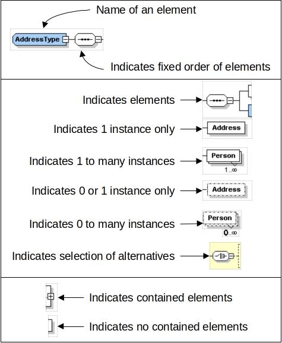

# B2MML - Work Definition

The Business To Manufacturing Markup Language (B2MML) is used courtesy of MESA International.

## Diagram Convention

The schema diagrams using the following convention to illustrate the structure of the schema elements, the type of the elements and attributes, and the rules for optional elements and repetition. 



## Schema Scope

This document defines the information about the definition of work definition information that may be exchanged by manufacturing operations management systems.

This information is based on the data models and attributes defined in the ANSI/ISA 95.00.04 Enterprise/Control System Integration standard.

Contact ISA (The Instrumentation, System, and Automation Society) for copies of the standard. Additional information on the standard is available at www.isa.org. 

### Key Information Assumptions

The data represented in these schemas is derived from the UML model below.

This model is defined in the ANSI/ISA 95.00.04 standard.

The key assumption is that the information will be accessed by a Work Master, a Work Directive, or a Work Definition Information element which allows for the exchange of multiple WorkDirectives and WorkMasters in a single WorkDirectiveInformation message.  

[exchanged work definition information model](models/exchanged-work-definition-information-model.jpg)

This schema uses a common schema for definition of elements that are used in multiple schemas, such as ID, Description, and Value.  See the document defining the Common schema for definition of the common elements.

### Type Definitions

The XML schema uses a model that defines simple and complex data types for each element.  The data types all follow the convention of a suffix of “Type” added to the element name.  Elements that have the same name in other B2MML schemas are also prefixed with “Op” to uniquely identify the extension group.
  
Schema definition:

````xsd

<xsd:element name = "OpPersonnelSpecification"  type = " OpPersonnelSpecificationType"/>

<xsd:complexType name = "OpPersonnelSpecificationType">
    <xsd:sequence>
      <xsd:element name = "PersonnelClassID" type = "PersonnelClassIDType" 
                                             minOccurs = "0" />
     …
</xsd:complexType>
````

The method is a modification of the “Venetian Blind Model”, defined in the book Professional XML Schemas, 2001, published by WROX (ISBN 1-861005-47-4).  It makes all of the type names global and usable in user derived works, without a loss of context or additional information required to identify the element as of being of the same type as related B2MML elements.

### WorkDefinitionInformation

A main structuring element of the schema definition is **WorkDefinitionInformation**.

This element allows for the exchange of multiple **WorkMaster** and **WorkDirective** elements in a single message.

### WorkDefinition

A **WorkDefinition** is an abstract type used for **WorkMasters** and WorkDirectives.  

### WorkMaster

A **WorkMaster** element defines the exchange information structure for a Work Master, as defined in ANSI/ISA95 Part 4.

This is a recursive structure that allows for the exchange of Work Masters that contain subservient Work Masters. 

### WorkDirective  

A **WorkDirective** element defines the exchange information structure for a Work Directive, as defined in ANSI/ISA95 Part 4.  

The exchange information includes the ID of the **WorkMaster** the **WorkDirective** was derived from.

This is a recursive structure that allows for the exchange of Work Directives that contain subservient Work Directives. 

### PersonnelSpecification

**PersonnelSpecification** elements define the personnel resources, by class or instance, required for production of the product within a work definition, such as 2 hours of a painter for a work master for a lot size of one widget. 

### EquipmentSpecification

**EquipmentSpecification** elements define the equipment resources, by class or instance, required for production of the product within a work definition, such as 2 hours for a paint station for a lot size of one widget.

### PhyscialAssetSpecification

**PhysicalAssetSpecification** elements define the physical assets resources, by class or instance, required for work, such as 2 hours for a paint station for a lot size of one widget.

### MaterialSpecification

**MaterialSpecification** elements define the material resources, by material class or material definition, required for production of the product within a work definition, such as 30 Kg of cooking oil (material class) required for the cooking segment for a lot size of 50 Kg.  

### Resource Identification

[see here](../resource-identification)

### Element Definitions

#### WorkDefinitionInformation

*WorkDefinitionInformationType*

Contains a list of work masters and/or work directives.

Includes

- the hierarchy scope of the information
- the date of publication of the information

[work definition information element](elements/work-definition-information-element.jpg)

#### WorkMaster

*WorkMasterType*

Contains a Work Master.

Includes

- the hierarchy scope of the information
- the date of publication of the information
- equipment specification
- material specification
- personnel specification
- physical asset specification
- workflow specification
 
A **WorkMaster** may reference multiple different **OperationsDefinition**, or multiple parts of **OperationsDefinitions**.

1. The fact that a **WorkMaster** may be used in multiple **OperationsDefinitions**.
  - If the **WorkDefinition** references the entire **OperationsDefinition**, the **OperationsDefinitionID** contains the **OperationsDefinition** ID.
2. The **WorkMaster** may only accomplish part of the operation, so it should reference the elements making up the Operations Definition, the Operations Segment.
  - If the **WorkDefinition** references part of an **OperationsDefinition** and the **OperationsSegment** IDs are not unique across all **OperationsDefinitions**, then the **OperationsSegmentID** should contain the entire ID path to the **OperationsSegment**.
    - For Example: “R123/020/010” for the Operations Segment 010, within Operations Segment 020 within Operations Request R123. 

[work master element](elements/work-master-element.jpg)

#### WorkDirective

*WorkDirectiveType*

Contains a Work Directive. Includes

- the hierarchy scope of the information
- the date of publication of the information
- the equipment, material, personnel, physical asset, and workflow specification of the Work Directive
- the ID of the associated Work Master. 
 
A **WorkDirective** may reference multiple different **OperationsDefinition**, or multiple parts of **OperationsDefinitions**.  

1. The fact that a **WorkDirective** may be used in multiple **OperationsDefinitions**.
  - If the **WorkDefinition** references the entire **OperationsDefinition**, the **OperationsDefinitionID** contains the **OperationsDefinition** ID.
2. The **WorkDirective** may only accomplish part of the operation, so it should reference the elements making up the Operations Definition, the Operations Segment.
  - If the **WorkDefinition** references part of an **OperationsDefinition** and the **OperationsSegment** IDs are not unique across all **OperationsDefinitions**, then the **OperationsSegmentID** should contain the entire ID path to the **OperationsSegment**.  
    - For Example: “R123/020/010” for the Operations Segment 010, within Operations Segment 020 within Operations Request R123. 

[work directive element](elements/work-directive-element.jpg)

#### EquipmentSpecification

*OpEquipmentSpecificationType*

Contains a definition of the equipment resources required for the work definition.

Includes

- the identification of the class or instance of the resources
- the quantity of the resource
- the property specification if required to identify the resource. 

[op equipment specification type](types/op-equipment-specification-type.jpg)

#### EquipmentSpecificationProperty

*OpEquipmentSpecificationPropertyType*

Contains a definition of an equipment property required for the work definition, including the quantity of the resource, and a value used to identify the subset of the class.

#### MaterialSpecification

*OpMaterialSpecificationType*

Contains a definition of the material resources required for the work definition.

Includes

- the identification of the class or instance of the resources
- the quantity of the resource
- the use (consumed, produced)
- any specification assemblies
- the property specification if required to identify the resource

A **MaterialSpecification** element may have a set of contained **AssemblySpecification** elements to support hierarchical manufacturing bills.

[op-material-specification-type.jpg](types/op-material-specification-type.jpg)

#### MaterialSpecificationProperty

*OpMaterialSpecificationPropertyType*

Contains a definition of a material property required for the work definition, including the quantity of the resource, and a value used to identify the subset of the class.

#### PersonnelSpecification

*OpPersonnelSpecificationType*

Contains a definition of the personnel resources required for the work definition.

Includes

- the identification of the class or instance of the resources
- the quantity of the resource
- the property specification if required to identify the resource

[op personnel specification type](types/op-personnel-specification-type.jpg)

#### PersonnelSpecificationProperty

*OpPersonnelSpecificationPropertyType*

Contains a definition of a personnel property required for the work definition.

Including

- the quantity of the resource
- a value used to identify the subset of the class

#### PhysicalAssetSpecification

*OpPhysicalAssetSpecificationType*

Contains a definition of the physical asset resources required for the work definition.

Includes

* the identification of the class or instance of the resources
* the quantity of the resource
* the property specification if required to identify the resource

[op physical asset specification type](types/op-physical-asset-specification-type.jpg)

#### PhysicalAssetSpecificationProperty

*OpPhysicalAssetSpecificationPropertyType*

Contains a definition of a physical asset property required for the work definition.

Includes

- the quantity of the resource
- a value used to identify the subset of the class

##### WorkflowSpecification

*WorkflowSpecificationType*

Contains a workflow specification.

See the Workflow Specification documentation for details. 

#### Transaction Elements

The following elements are defined to support the ISA 95 Part 5 transactions, using the transaction data types defined in the B2MML-Common.xsd schema. 

Work Definition Information Elements      | Description
------------------------------------------|------------
**GetWorkDefinitionInformation**          | Get **WorkDefinitionInformation** definitions. 
**ShowWorkDefinitionInformation**         | Returned information from the **GetWorkDefinitionInformation** message.
**ProcessWorkDefinitionInformation**      | Process **WorkDefinitionInformation** definitions.
**AcknowledgeWorkDefinitionInformation**  | Returned status from the **ProcessWorkDefinitionInformation** message.
**ChangeWorkDefinitionInformation**       | Change **WorkDefinitionInformation** definitions.
**RespondWorkDefinitionInformation**      | Returned status from the **ChangeWorkDefinitionInformation** message.
**CancelWorkDefinitionInformation**       | Cancel **WorkDefinitionInformation** definitions.
**SyncWorkDefinitionInformation**         | Published **WorkDefinitionInformation** definitions.

Work Master Definition Elements           | Description
------------------------------------------|------------
**GetWorkMaster**                         | Get a **WorkMaster** definition. 
**ShowWorkMaster**                        | Returned information from the **GetWorkMaster** message.
**ProcessWorkMaster**                     | Process a **WorkMaster** definition.
**AcknowledgeWorkMaster**                 | Returned status from the **ProcessWorkMaster** message.
**ChangeWorkMaster**                      | Change a **WorkMaster** definition.
**RespondWorkMaster**                     | Returned status from the **ChangeWorkMaster** message.
**CancelWorkMaster**                      | Cancel a **WorkMaster** definition.
**SyncWorkMaster**                        | Published **WorkMaster** definition.


Work Directive Definition Elements
Description
GetWorkDirective
Get a WorkDirective definition. 
ShowWorkDirective
Returned information from the GetWorkDirective message.
ProcessWorkDirective
Process a WorkDirective definition.
AcknowledgeWorkDirective
Returned status from the ProcessWorkDirective message.
ChangeWorkDirective
Change a WorkDirective definition.
RespondWorkDirective
Returned status from the ChangeWorkDirective message.
CancelWorkDirective
Cancel a WorkDirective definition.
SyncWorkDirective
Published WorkDirective definition.
