# BatchML - Batch Information

The Business To Manufacturing Markup Language (B2MML) is used courtesy of MESA International.

## Change history

These are changes to source docx file for subsequent changes inspect the git repository

| Change | Date        | Person           | Description
| ------ | ----        | ------           | -----------
| V01    |7 April 2002 | Dennis Brandl <br/>Dave Emerson| Initial release
| V01-01 |7 March 2003 | Dennis Brandl    |Changed use of ##any to an encapsulating element AnyType and use of Other in enumerated types
| V02    |23 Sept 2003 | Dennis Brandl    |Changed to support V02 & single schema file <br/> Inserted documentation on DateType
| V0401  |Oct 2008     | Dennis Brandl <br/>Dave Emerson |Added substitution groups for extensions, now matches B2MML. <br/>Convert to the B2MML Name Space<br/>Change multiple type names by appending “Batch” to eliminate type name conflicts<br/>Change the version numbering to match the associated B2MML version. <br/>Change name to B2MML BatchInformation
| V0500  |Mar 2011     |Dennis Brandl     |Removed AnyType (##any) from all elements.
| V0600  |Aug 2012     |Dennis Brandl     |Updated version documentation and MESA name in copyright.<br/>Corrected V0500 Errata #2, incorrect extension in FromIDType. 
| V0700  |Aug 2016     |Dennis Brandl     |Updated version number

## Diagram Convention

The schema diagrams using the following convention to illustrate the structure of the schema elements, the type of the elements and attributes, and the rules for optional elements and repetition. 


## Schema Scope

This document provides explanatory information about the referenced MESA XML schemas used to exchange information about recipes, equipment, and batch lists, called the Batch Markup Language, or BatchML.  

This information is based on the data models and attributes defined in the ANSI/ISA 88.00.02 Batch Control standard Part 2. Contact ISA (The Instrumentation, Systems, and Automation Society) for copies of the standard. Additional information on the standard is available at www.isa.org.

### Referenced Schemas

This document provides addresses the contents of the following MESA XML schema [BatchML-BatchInformation.xsd](../../../Schema/BatchML-BatchInformation.xsd)

### Key Use Assumptions

The schemas define exchanged information and do not define the use of the information or encapsulation of the information in any defining transactions.  These schemas are intended to be used to create XML documents used to exchange batch data as well as serve as the basis for corporate, system or application specific schemas that may be derived from the BatchML schemas.

### Key Information Assumptions

The schemas define simple and complex types and elements for recipe, equipment and batch list data commonly found in batch applications.  A set of data models is presented for recipes, equipment and batch lists.  Each model also illustrates the equivalent top-level XML elements that correspond to top-level objects identified in the ANSI/ISA-88 standard.  The details of the schema element and attribute definitions are contained in later sections of this document. 

### Common Data Types

The BatchML BatchInformation schema used the B2MML Common schema to pick up common data types.

See the documentation for the Core Components and B2MML Common Types used in BatchML in the file: [B2MML-Common](../B2MML-Common)

### Core Components

The BatchML BatchInformation schema used the B2MML Core Component schemas. 

The base types for most elements are derived from core component types that are compatible with the UN/CEFACT core component types.  The UN/CEFACT core component types are a common set of types that define specific terms with semantic meaning (e.g. the meaning of a quantity, currency, amount, identifier …).  The UN/CEFACT core components were defined in a Core Components Technical Specification (CCTS) developed by the ebXML project now organized by UN/CEFACT and ISO TC 154. 

The core components are defined in the schema file: [B2MML-CoreComponents.xsd](../../../Schema/B2MML-CoreComponents.xsd)

## Schema Organization

A definition of all data **types** and all **elements** used in the other schemas with a target name space. This schema may be “Imported” into other schemas to permit use of selected types with name space tags.

````xsd
<xsd:schema
    	xmlns:xsd 		   = "http://www.w3.org/2001/XMLSchema"
		xmlns:batchml        = "http://www.mesa.org/xml/BatchML-V0401"
        targetNamespace 	   = "http://www.mesa.org/xml/BatchML-V0401"
		xmlns			   = "http://www.mesa.org/xml/BatchML-V0401"
		elementFormDefault   = "qualified"
		attributeFormDefault = "unqualified">
````


e.g.

````xsd
<xsd:import  namespace 	 = "http://www.mesa.org/xml/BatchML"
			    schemaLocation = " BatchML-V600.xsd " />
````

### Element Definitions

Elements are also defined for each possible element of exchanged information.  This provides a very fine level of granularity for exchanged information, so that the XML schema standard used here can be used to exchange elements smaller than recipes, equipment definitions, or batch lists.  The smaller elements (such as a BatchID) may have meaning only within the context of another element, so if low level elements are exchanged, they should be exchanged within the context of a transaction or predefined agreement in order understand their context. 

### Top Level Elements

The BatchML root element is BatchInformation.  This element is not required, but is recommended.  
Any element may be used as the top-level element in a conforming XML document, but the recommended elements are:

- BatchInformation – Where enumeration sets are used in other objects, when encapsulating information (ListHeader) is needed, or when multiple objects must be contained in the same document. 
- MasterRecipe – When a complete master recipe is contained in a document. 
- ControlRecipe – When a complete control recipe is contained in a document. 
- RecipeBuildingBlock – When a recipe element or a library of recipe elements are contained in a document. 
- EquipmentElement – When an equipment definition is contained in a document. 
- BatchList– When a batch list is contained in a document. 
- EnumerationSet – When an enumeration set is contained in a document.

#### BatchInformation Element

A BatchInformation element serves as a container.  It is made up of zero or more top level elements: Master Recipes, Control Recipes, Recipe Building Blocks, and Equipment Definitions, Batch Lists, and Enumeration sets.   


### Type Names

The XML schema uses a model that defines simple and complex data types for each element.  The data types all follow the convention of a suffix of “Type” added to the element name.   

Schema definition:

````xsd  
<xsd:element name = "ApprovalDate"  type = "ApprovalDateType"/>

<xsd:simpleType name="ApprovalDateType">
       <xsd:restriction base="xsd:dateTime">
       </xsd:restriction>
 </xsd:simpleType>
````

### User Element Extensibility

In order to make the schemas more useful, they include the ability for elements to be extended.  The extended elements are not defined in this standard and should not be considered understandable between applications without prior agreement. 

The substitution group method is recommended as the best method for extending the schemas.  The BatchML elements that can be extended using substitution groups are:

- ApprovalHistory
- BatchInformation
- BatchListEntry
- BatchList
- BatchSize
- ClassInstanceAssociation
- Constraint
- ControlRecipe
- EnumerationSet
- Enumeration
- EquipmentConnection
- EquipmentElement
- BatchEquipmentID
- EquipmentProceduralElementClass
- EquipmentProceduralElement
- BatchEquipmentRequirement
- Formula
- FromEquipmentID
- FromID
- Header
- IndividualApproval
- Link
- ListHeader
- MasterRecipe
- ModificationLog
- OtherInformation
- Parameter
- ProcedureLogic
- Property
- RecipeBuildingBlock
- RecipeElement
- Step
- ToID
- Transition
- Value

See the document [B2MML-Extensions](../B2MML-V0401-Extensions) for a complete explanation of user extensibility.

### User Enumeration Extensibility

The ANSI/ISA-88.00.02 Batch control standard Part 2 clause 5 defines sets of specific enumerations for batch data and a means for extending the enumeration sets.  BatchML provides support for these enumerations and their extension.  The extended enumeration values are not defined in this standard and should not be considered understandable between applications without prior agreement.
 
To provide for user extended enumerations all types that contain enumerated values have an enumeration value of “Other” and an attribute of “OtherValue”

Any element, in an instance document, with an extended enumeration should use the enumeration value of Other and place the actual enumeration in the OtherValue attribute. 

The BatchML elements that can be extended with Enumerations:

- BatchListEntryType
- ConnectionType
- DataInterpretationType
- DataType
- DepictionType
- EquipmentElementLevel
- EquipmentElementType
- EquipmentProceduralElementType
- FromType
- IDScope
- LinkType
- Mode
- ParameterType
- RecipeElementType
- Status
- ToType

The enumerations and “OtherValue” attribute are added in two steps in the schemas.  This is done due to a restriction in W3C schemas that prevent restrictions (enumeration values) and extensions (adding an attribute) at the same time.  The complex type naming convention used is to use a 1 in the temporary complex type (complex type name = ‘element name’ + ‘1’ + ‘Type’) and use the same name without the ‘1’ for the final complex type name.  XML authors can ignore the two-step process, the temporary type is not intended for use in XML documents only for schema consistency.


Schema definition:

````xsd
  <xsd:simpleType name = "EquipmentProceduralElementType1Type">
      <xsd:restriction base = "xsd:string">
        <xsd:enumeration value = "Procedure" />
        <xsd:enumeration value = "UnitProcedure" />
        <xsd:enumeration value = "Operation" />
        <xsd:enumeration value = "Phase" />
        <xsd:enumeration value = "Other" />
      </xsd:restriction>
  </xsd:simpleType>

  <xsd:complexType name = "EquipmentProceduralElementTypeType">
    <xsd:simpleContent>
      <xsd:extension base = "EquipmentProceduralElementType1Type">
        <xsd:attribute name = "OtherValue" type = "xsd:string"/>
      </xsd:extension>
    </xsd:simpleContent>
  </xsd:complexType>
````

Used in XML document:

````xsd
<BatchML:EquipmentProceduralElementType>
	Operation
</BatchML:EquipmentProceduralElementType>


<BatchML:EquipmentProceduralElementType OtherValue = “MacroPhase”>
	Other
</BatchML:EquipmentProceduralElementType>
````

## Recipe Model

The exchanged information is derived from the UML models below.  These models are derived from the ANSI/ISA-88.00.02 model and describe the three basic elements of the 88.00.02 object model standard: master recipes, control recipes, and recipe building blocks. 

### Master Recipe

A master recipe is a template recipe that is used to create control recipes.  A master recipe defines the formula and procedure for a product (batch) and is targeted to a process cell (or process cell class).


#### MasterRecipe Element

The object model above is represented in the XML schema through the following structure. 


### Control Recipe

A control recipe is the same format as a master recipe, with additional information about execution. A control recipe does not need to indicate all steps and transitions.  Unexecuted (or unreachable steps and transitions do not need to be included in the definition. 

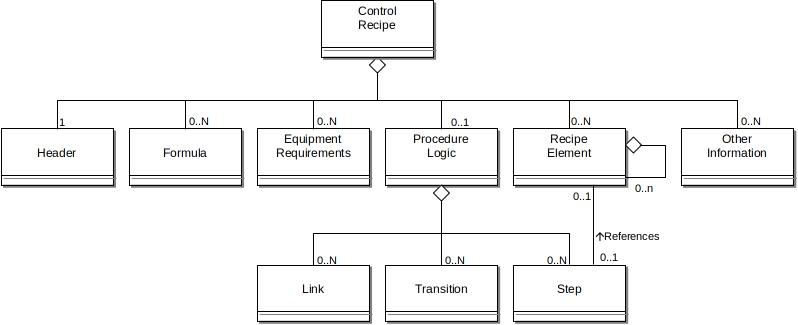

#### ControlRecipe Element
The object model above is represented in the XML schema through the following structure. 


### Recipe Building Blocks

Recipe library elements are defined as recipe building blocks.  Recipe elements are used to represent the building blocks and contain most of the parts of a recipe. The recipe element may describe any level of the procedural hierarchy (unit procedure, operation, and phase).

[Recipe Building Block Object Model](models/recipe-building-blocks-model.jpg)

#### RecipeBuildingBlock Element

The object model above is represented in the XML schema through the following structure. 

[Recipe Building Block element](elements/recipe-building-block-element.jpg)

### Recipe Header

A recipe’s header contains Information about the purpose, source and version of the recipe such as recipe and product identification, creator, status, approvals, and issue date.  

Recipe header information is described in Header elements.  The header has information that may only be pertinent to control recipes, such as the actual produced product, as well as information needed by master recipes and recipe building blocks. 

##### Header Element

Recipe header information is represented in the XML schema through the following structure. 

[header type](types/headewr-type.jpg)

### Recipe Formula

A recipe’s formula is a category of information that includes process inputs, process parameters, and process outputs. 

| category              | Use
|-----------------------|----
|Process Input          | A process input is the identification and quantity of a raw material or other resource required to make the product.  In addition to raw materials that are consumed in the batch process in the manufacture of a product, process inputs may also include energy and other resources such as manpower.  Process inputs consist of both the name of the resource and the amount required to make a specific quantity of finished product.  Quantities may be specified as absolute values or as equations based upon other formula parameters or the batch or equipment size.
|Process Parameter      | A process parameter details information such as temperature, pressure, or time that is pertinent to the product but does not fall into the classification of input or output.  Process parameters may be used as set points, comparison values, or in conditional logic. 
|Process Output         | A process output is the identification and quantity of a material and/or energy expected to result from one execution of the recipe.   

A recipe’s formula information is described in a list of Formula elements.  Process Inputs and process outputs are represented as parameters.

#### Formula Element

Formula information is represented in the XML schema through the following structure.  Note the use of *BatchParameterType* for a Parameter. 

[formula types](types/formula-type.jpg)

[parameter element](elements/parameter-element.jpg)

### Recipe Element

The recipe procedure structure is recursive, and the ANSI/ISA-88 standard allows for collapsing or expansion of the recursive procedural hierarchy.  The element RecipeElement is used to describe the recursive definition of the recipe structure.  A recipe’s procedural definition is defined in RecipeElement and ProcedureLogic elements.  

A RecipeElement  contains a header, formula (described in parameters), equipment requirements, other information, and recipe procedure (described in RecipeElement and ProcedureLogic).   The ProcedureLogic defines the steps and transitions in the procedural logic.  The elements that the steps reference (unit procedures, operations, or phases) are described in the enclosed RecipeElement.  Alternately the RecipeElement may identify a RecipeElement described in a RecipeBuildingBlock.

#### RecipeElement Element

The object model above is represented in the XML schema through the following structure. 


[recipe element element](elements/recipe-element-element.jpg)

### Recipe Procedural Hierarchy

The use of the schemas for exchange information is based on the concept of nested procedural elements that make up a recipe, as illustrated in the figure below.

[nesting recipe elements](etc/nesting-recipe-elements.jpg)

The use model allows for the alternate representations of a recipe procedure.  The following diagram illustrates the nesting of standard recipe procedural elements.  These can also be further expanded using application specific recipe procedural levels, such as Macro Phases or Sub Operations.  

[alternative-procedural-hierarchies](etc/alternative-procedural-hierarchies.jpg)

The following diagram illustrates the use of RecipeElement, ProcedureLogic, and Step to describe the possible hierarchies.  This shows an example where there is a class procedural element “Heat” that is used twice in a master recipe’s procedure.  The steps describe the order and sequence of the use of Heat, the RecipeElement describe the parameters of use, and the RecipeBuildingBlock describes the class. 

[Relationship of Steps to RecipeElement to Class Definitions](etc/relationship-of-steps-to-recipeElement-to-class-definitions.jpg)

The use of the class definition through RecipeBuildingBlock is optional, a recipe may be self contained and reference no classes or library elements.   In those cases the RecipeElement within the MasterRecipe (or ControlRecipe) contains the complete description.

### ProcedureLogic

ProcedureLogic contains a definition of the procedural logic in a recipe procedure, as defined in ANSI/ISA-88.00.02. Procedure logic is made up of steps, transitions, and links between steps and transitions, steps and steps, and transitions and transitions.  

[procedure logic element](elements/procedure-logic-element.jpg)

### Step

A Step element in a ProcedureLogic element describes a single instance of use of a recipe element (unit operation, operation, or phase).  Steps may also correspond to non procedural elements used in procedure diagrams, such as the Begin and End symbols, and the Allocation and Deallocation symbols.

[step element](elements/step-element.jpg)

### Transition

A transition element in a ProcedureLogic element describes a single instance of a transition in the logic.

[transition element](elements/transition-element.jpg)

### Link

A Link element in a ProcedureLogic element describes an execution sequence link between the steps and transitions.  The FromID and ToID elements may be a StepID or TransitionID, allowing step to transition, transition to step, step to step, and transition to transition links.  The ordering of the links, as required for proper procedure execution is defined in the EvaluationOrder element.  

[link element](elements/link-element.jpg)

## Equipment Model

The data represented in these schemas is derived from the UML model below.  This model is derived from the object models in the ANSI/ISA 88.00.02 standard.  The information model in the model below is hierarchical and is defined as equipment elements and the contained elements.  Enumeration set information is defined separately, as identified by the dotted collection in the figure below.  

[equipment model](models/equipment-model.jpg)

### EquipmentElement

Equipment and equipment classes are represented in EquipmentElement.  Equipment may be definitions of sites, areas, production units, production lines, work cells, process cells, or units.   

#### EquipmentElement Element

The object model above is represented in the XML schema through the following structure. 

[equipment element element](elements/equipment-element-element.jpg)

An EquipmentElement may contain the definition of classes and instances.  Each enclosed EquipmentElement defines its type (Class or Instance) in the EquipmentElement Type.  

An EquipmentElement also contains the ISA-88 equipment level (EquipmentElementLevel), properties, equipment procedural element classes it defines (EquipmentProceduralElementClass), equipment procedural elements it implements (EquipmentProceduralElement), connections to other equipment(EquipmentConnection), and other equipment it contains (EquipmentElement or EquipmentElementID). 

### Equipment Hierarchy

The equipment schema allows the definition of the ANSI/ISA-88.00.01 model for the equipment hierarchy, as shown in the figure below.   The terminology used in naming the equipment levels follows the ISA standard.

[equipment hierarchy](etc/equipment-hierarchy.jpg)

### Equipment Classes

The association between classes and instances is defined in the enclosing EquipmentElement.  For example, a UnitType Reactor and 2 instances of the reactor (Unit1 and Unit2) may be defined within the enclosing Process Cell #1.  The ClassInstanceAssociation defines each association of a class to an instance.  In this example, there would be two instances of ClassInstanceAssociation in the Process Cell #1 element

There are multiple methods for defining equipment classing and equipment procedural elements.   Equipment may be defined using a classical inheritance method (C++ inheritance style), or an “implements” type of inheritance (Java “Implements” inheritance mechanism).  

#### Inheritance

In the classical inheritance an element may be defined as being a member of a class by containing the class name in the “ClassInstanceAssociation” element.  For example a ProcessCell ReactorCell4 may contain a unit class called ReactorType (EquipmentClassID).  A ReactorUnit15 may be defined as being of a member of a ReactorType unit class.  If the ReactorType unit class defines properties (Property), such as “Maximum Temperature”, then ReactorUnit15 includes the property definition. If the ReactorType definition defines several phases (EquipmentProceduralElement), such as “Charge”, “Heat”, and “Discharge”, then “ReactorUnit15 also contains the definitions of the phases. 

[equipment inheritance classical](etc/equipment-inheritance-classical.jpg)

````xml
<EquipmentElement>
	<ID>Reactor Cell 4</ID>
	<EquipmentElementType>Instance</EquipmentElementType>
	<EquipmentElementLevel>ProcessCell</EquipmentElementLevel>

	<ClassInstanceAssociation>
		<ClassEquipmentID>ReactorType<ClassEquipmentID>
		<MemberEquipmentID>ReactorUnit15<MemberEquipmentID>
	</ClassInstanceAssociation>
	<ClassInstanceAssociation>
		<ClassEquipmentID>ReactorType<ClassEquipmentID>
		<MemberEquipmentID>ReactorUnit16<MemberEquipmentID>
	</ClassInstanceAssociation>
	<ClassInstanceAssociation>
		<ClassEquipmentID>ReactorType<ClassEquipmentID>
		<MemberEquipmentID>ReactorUnit17<MemberEquipmentID>
	</ClassInstanceAssociation>
	<ClassInstanceAssociation>
		<ClassEquipmentID>ReactorType<ClassEquipmentID>
		<MemberEquipmentID>ReactorUnit18<MemberEquipmentID>
	</ClassInstanceAssociation>

	<EquipmentElement>
		<ID>ReactorType</ID>
		<EquipmentElementType>Class</EquipmentElementType>
		<EquipmentElementLevel>Unit</EquipmentElementLevel>
		<EquipmentProceduralElementClass>
			<ID>ADD</ID>
			…
		</EquipmentProceduralElementClass>
		…
	</EquipmentElement>

	<EquipmentElement>
		<ID>ReactorUnit15</ID>
		<EquipmentElementType>Instance</EquipmentElementType>
		<EquipmentElementLevel>Unit</EquipmentElementLevel>
	</EquipmentElement>
	<EquipmentElement>
		<ID>ReactorUnit16</ID>
		<EquipmentElementType>Instance</EquipmentElementType>
		<EquipmentElementLevel>Unit</EquipmentElementLevel>
	</EquipmentElement>
	<EquipmentElement>
		<ID>ReactorUnit17</ID>
		<EquipmentElementType>Instance</EquipmentElementType>
		<EquipmentElementLevel>Unit</EquipmentElementLevel>
	</EquipmentElement>
	<EquipmentElement>
		<ID>ReactorUnit18</ID>
		<EquipmentElementType>Instance</EquipmentElementType>
		<EquipmentElementLevel>Unit</EquipmentElementLevel>
	</EquipmentElement>
</EquipmentElement>
````

#### Implements

In the implements type of inheritance an encapsulating object, such as a process cell, may contain the definition of several phase classes (EquipmentProceduralElementClass).  Each unit within the process cell may then have an implementation instance of one or more phases.  For example, a process cell, MainMixingCell, may define phase classes of “Add”, “Mix”, “Heat”, “Chill”, and “Discharge”.  All units may implement the “Add”, “Mix”, and “Discharge” phases, but the “Heat” and “Chill” phases may not be implemented by all units. 

[equipment inheritance implements](etc/equipment-inheritance-implements.jpg)

````xml
<EquipmentElement>
	<ID>MainMixCell2</ID>
	<EquipmentElementType>Instance</EquipmentElementType>
	<EquipmentElementLevel>ProcessCell</EquipmentElementLevel>
	<EquipmentProceduralElementClass>
		<ID>ADD</ID>  <! more definition here >  …
	</EquipmentProceduralElementClass>
	<EquipmentProceduralElementClass>
		<ID>MIX</ID>  <! more definition here >  …
	</EquipmentProceduralElementClass>
	<EquipmentProceduralElementClass>
		<ID>Discharge</ID>  <! more definition here >  …
	</EquipmentProceduralElementClass>
	…

	<EquipmentElement>
		<ID>MixingUnit8</ID>
		<EquipmentElementType>Instance</EquipmentElementType>
		<EquipmentElementLevel>Unit</EquipmentElementLevel>
		<EquipmentProceduralElement>
			<ID>ADD</ID> 
			<EquipmentProceduralElementClassID>ADD</EquipmentProceduralElementClassID
		</EquipmentProceduralElement>
		<EquipmentProceduralElement>
			<ID>MIX</ID> 
			<EquipmentProceduralElementClassID>MIX</EquipmentProceduralElementClassID
		</EquipmentProceduralElement>
	</EquipmentElement>
	. . . <! other units defined here >
</EquipmentElement>
````

## Batch List Model

The data represented in these schemas is derived from the UML model below.  This model is derived from the object models in the ANSI/ISA 88.00.02 standard Clause 4, but it does not directly implement the full definitions of the batch schedule elements defined in Part 2, Clause 5.    

[batch list model](models/batch-list-model.jpg)

### BatchList

The main structuring element of the schema definition is BatchList.   It contains zero or more batch list entries. 

[batch list element](elements/batch-list-element.jpg)

A batch list contains the list of batches for a process cell.  This may be a list of batches to be added to the cell, the list of batches currently scheduled in the cell, or the list of batches currently scheduled and completed in the cell.  Encapsulating transactions, not defined in this standard, may be defined to use this structure to add, delete, or change the batches in a process cell batch list.

### BatchListEntry

A Batch list entity is represented in a BatchListEntry element.  A batch list entry usually corresponds to a single batch, with a single master recipe but may correspond to a campaign, scheduled unit procedures, or procedures.
A batch list entry may contain multiple batch entries.  This allows the structure to describe a wide variety of situations.  For example, a campaign (which is not defined in the ANSI/ISA-88 standard) may be described as a single batch list entry that contains a batch list entry for each batch that makes up the campaign.  A batch list may also be used to describe the unit procedures and operations within a recipe, if that is the detail managed by a process cell. 

A batch list entry contains information about the starting conditions, scheduled times, actual times, scheduled batch size, actual batch size, and equipment binding.   Some of the elements may not have a meaning for batch list entries which are not batch entries.  For example, a batch size may not be appropriate for an entry representing a unit procedure or operation. 

[batch list entry element](elements/batch-list-entry-element.jpg)

## Enumerations

The ANSI/ISA-88 standard includes the ability to exchange user defined enumeration sets.  Enumerations may be used as parameters in recipe procedural elements and equipment procedural elements (usually phases).  Many equipment systems will not handle arbitrary length strings, due to the memory limitations of PLC and DCS based control systems, therefore the enumerations are provided to enable human readable value, such as “Red”, “Green”, and “Blue” in place of integer values, such as 0, 1, and 2.   

These enumerated items are passed as strings or integers in exchanged XML files, with the equivalent integer or string value contained in an enumeration set table.  The enumeration sets also provide a single location for translation of the strings between different languages. 
XML enumerations are used for all standard enumeration values, such as recipe procedure level (Procedure, Unit Procedure, Operation, and Phase) and should not be confused with the ANSI/ISA-88 enumeration sets.  

There is one EnumerationSet element for each enumeration set.  Within the set there is one Enumeration element for each enumeration value. 

[enumeration set element](elements/enumeration-set-element.jpg)

[enumeration element](elements/enumeration-element.jpg)

## Element Definitions

### Top Level Elements

#### BatchInformation

*BatchInformationType*

Contains a list of master recipes, control recipes, recipe building blocks, equipment elements, batch lists, and/or enumeration sets.  


#### MasterRecipe

*MasterRecipeType*

Contains the elements of a master recipe:
ID, Version, VersionDate, Description, Header, EquipmentRequirement, Formula, ProcedureLogic, RecipeElement, and OtherInformation. 


#### ControlRecipe

*ControlRecipeType*

Contains the elements of a control recipe:

ID, Version, VersionDate, Description, Header, EquipmentRequirement, Formula, ProcedureLogic, RecipeElement, and OtherInformation.


#### RecipeBuildingBlock

*RecipeBuildingBlockType*

Contains a list of RecipeElement defining a recipe building block set. 

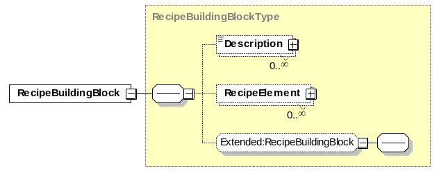

#### EquipmentElement

*EquipmentElementType*

Contains the elements of an Equipment element:

ID, Description, EquipmentElementType, EquipmentElementLevel, ClassInstanceAssociation, Properties, EquipmentProceduralElementClass, EquipmentProceduralElement, EquipmentConnection, EquipmentElement,  and EquipmentElementID.

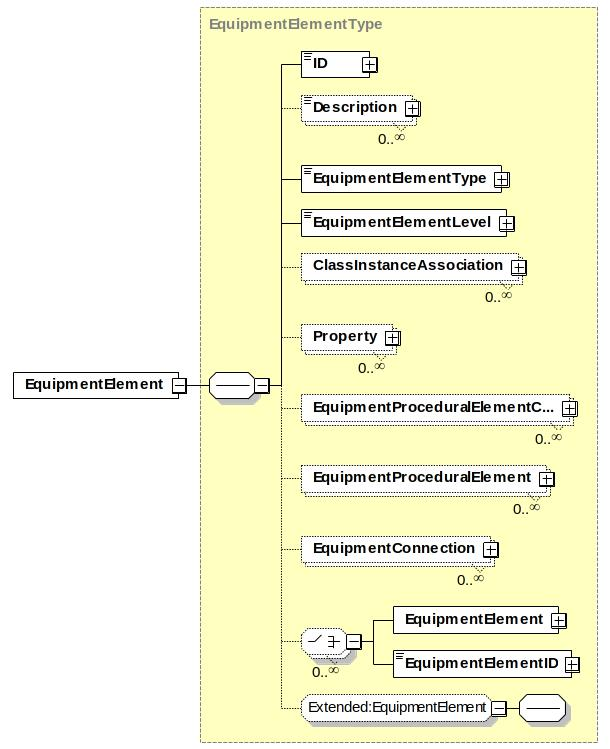

#### BatchList

*BatchListType*

Contains a list of BatchListEntry:
ListHeader, Description, and BatchListEntry.

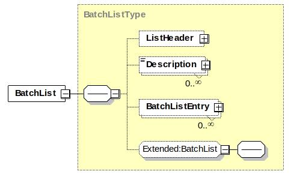

#### EnumerationSet

*EnumerationSetType*

Contains a list of Enumeration elements that make up an enumeration set.

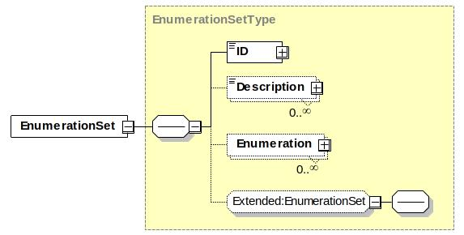

### Common Elements

#### ActualBatchSize

*ActualBatchSizeType*

A float number containing an actual batch size.

#### ActualEndTime

*ActualEndTimeType*

A date/time defining an actual end time of a batch or batch list entry.  Defined in B2MML Common Types. 

A specific instance on time using the ISA 8601 CE (Common Era) calendar extended format and abbreviated versions. For example:
yyyy-mm-ddThh:mm:ssZ for UTC as “2002-09-22T09:15:23Z”.

#### ActualEquipmentID

*ActualEquipmentIDType*

A string containing the ID of an actual equipment element. 

#### ActualProductProduced

*ActualProductProducedType*

A string containing the ID of the actual product produced, which may have been different than the requested type due to process problems or raw material differences. 

#### ActualStartTime

*ActualStartTimeType*

A date/time defining an actual start time of a batch or batch list entry. Defined in B2MML Common Types.

A specific instance on time using the ISA 8601 CE (Common Era) calendar extended format and abbreviated versions. For example:

yyyy-mm-ddThh:mm:ss for local time as “2002-09-22T09:15:23”.

#### ApprovedBy

*ApprovedByType*

A string containing the identity of an approval person, system, or authority.

#### ApprovalDate

*ApprovalDateType*

A date/time containing the approval date and time of an element. 

A specific instance on time using the ISA 8601 CE (Common Era) calendar extended format and abbreviated versions.

#### ApprovalHistory

*ApprovalHistoryType*

A record of approval history associated with an element. Contains the final approval date and a list of individual approvals. 

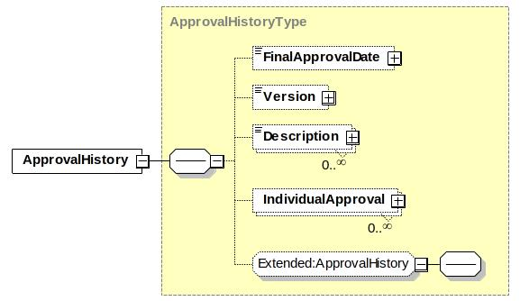

#### Author

*AuthorType*

A string containing the identification of the author or entity of an element. 

#### BatchID

*BatchIDType*

A sting containing an ID of a batch.

#### BatchListEntry

*BatchListEntryType*

Contains a batch list entry.  See description and diagram in Section 5.2

#### BatchListEntryType

*BatchListEntryTypeType*

Identifies the type of a batch list entry.

This may be either a standard type or an application specific extended type.

Standard enumerations are:

- Campaign
- Batch
- UnitProcedure
- Operation
- Phase
- Other

“Campaign” is not defined in the ANSI/ISA-88 standard but is used to indicate a series of related batches, the other enumerations are defined in the ANSI/ISA-88 standard. 

If “Other” then the type is an application specific extension and the value is defined in the attribute “OtherValue”.

#### BatchPriority

*BatchPriorityType*

An integer that specifies a priority of a batch list entry. Lower numbers have higher priority (e.g., Priority 1 is more important than Priority 7).

#### BatchSize

*BatchSizeType*

A definition of the size of a batch.  

This includes a possible definition of the unit of measure, maximum size, minimum size, scaled size, and nominal size. 

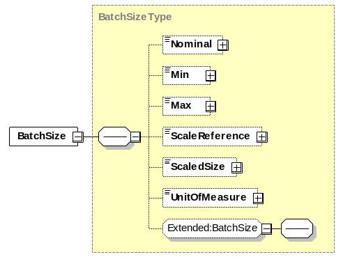

#### BuildingBlockElementID

*BuildingBlockElementIDType*

A string containing the ID of a building block element. 

#### BuildingBlockElementVersion

*BuildingBlockElementVersionType*

A string containing the version of a building block element.

#### CampaignID

*CampaignIDType*

A string containing the identification of a campaign (usually a collection of batches).

#### ClassEquipmentID

*ClassEquipmentIDType*

A string containing the identification of an equipment class. 

#### ClassInstanceAssociation

*ClassInstanceAssociationType*

Defines one EquipmentElement class to an EquipmentElement instance (member) association within the scope of the enclosed EquipmentElement. 

Each class may have multiple members, each member may belong to multiple classes.

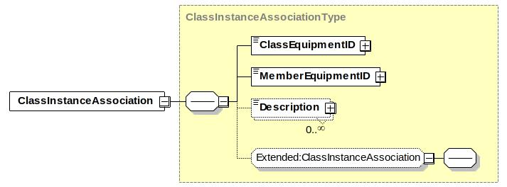

#### Condition

*ConditionType*

A string containing a condition expression.  

The format for the string expression is not defined in the standard. 

#### ConditionAnnotation

*ConditionAnnotationType*

A string containing additional annotation on a start condition. 

#### ConnectionType

*ConnectionTypeType*

An identification of the connection type between equipment.  

This may be either a standard type (see ANSI/ISA-88) or an application specific extended type.  Standard enumerations are:

- MaterialMovement
- Other

If “Other” then the type is an application specific extension and the value is defined in the attribute “OtherValue”.

#### Constraint

*ConstraintType*

Defines a constraint expression in an equipment requirement element.  

Each constraint may have an associated ID used to identify the associated type of constraint.


#### CreateDate

*CreateDateType*

A date/time defining the creation date of an element. 

A specific instance on time using the ISA 8601 CE (Common Era) calendar extended format and abbreviated versions.

#### DataInterpretation

*DataInterpretationType*

An identification of how to interpret a data value.  

This may be either a standard type (see ANSI/ISA-88) or an application specific extended type.  Standard enumerations are:

- Constant - Value should be treated as a constant value
- Reference - Value should be treated as a reference to data element in the procedure
- Equation - Value should be treated as an equation to be solved before being acted on
- External - Value should be treated as a reference to a value external to the procedure
- Other - the type is an application specific extension and the value is defined in the attribute “OtherValue”.

#### DataType

*DataTypeType*

An identification of the type of a parameter.  These types are based on the W3C types defined in the XSD specification, with the addition of “Enumeration” for user defined enumerations and “Other” for application specific extended types.  Defined in B2MML Common types.  

This may be either a standard type or an application specific extended type.  Standard enumerations are: 

- string
- byte
- unsignedByte
- binary
- integer
- positiveInteger
- negativeInteger
- nonNegativeInteger
- nonPositiveInteger
- int
- unsignedInt
- long
- unsignedLong
- short
- unsignedShort
- decimal
- float
- double
- boolean
- time
- timeInstant
- timePeriod
- duration
- date
- month
- year
- century
- recurringDay
- recurringDate
- recurringDuration
- Name
- QName
- NCName
- uriReference
- language
- ID
- IDREF
- IDREFS
- ENTITY
- ENTITIES
- NOTATION
- NMTOKEN
- NMTOKENS
- Enumeration
- Other

If “Other” then the type is an application specific extension and the value is defined in the attribute “OtherValue”.

#### DefaultValue

*DefaultValueType+

A string containing the default value for a parameter. 

#### Depiction

*DepictionType*

An identification of the type of a link depiction.  

This may be either a standard (see ANSI/ISA-88) type or an application specific extended type.  Standard enumerations are: 

- None - No connection between elements to be shown
- Line - Single line only between elements
- LineAndID - Single line with an annotation ID between elements
- LineAndArrow - Single line with arrow to indicate the direction of the link
- LineArrowAndID - Single line with annotation ID and arrow to indicate the direction of the link
- Other - the type is an application specific extension and the value is defined in the attribute “OtherValue”.

#### Description

*DescriptionType*

A string containing a description of an element.  Defined in B2MML Common Types. 

#### EffectiveDate

*EffectiveDateType*

A date/time containing a date an element is effective.  Usually the date of effectivity a master recipe or recipe building block element. 

A specific instance on time using the ISA 8601 CE (Common Era) calendar extended format and abbreviated versions.

#### Enumeration

*EnumerationType*

Defines an enumeration element, which contains a string and an associated numerical value. 

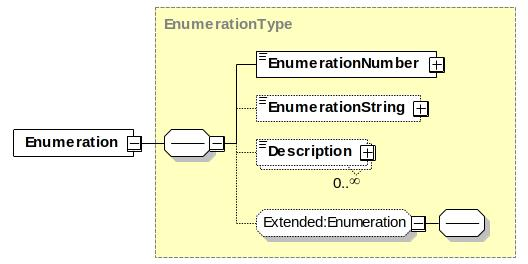

#### EnumerationNumber

*EnumerationNumberType*

An integer containing an enumeration numerical equivalent.

#### EnumerationSetID

*EnumerationSetIDType*

A string containing the ID of an enumeration set.

#### EnumerationString

*EnumerationStringType*

A string containing the string identification of an enumeration value.

#### EquipmentClassID

*BatchEquipmentClassIDType*

A string containing the ID of an equipment class.

#### EquipmentConnection

*EquipmentConnectionType*

Defines a connection between equipment elements, such as movement of materials. 


#### EquipmentElementID

*EquipmentElementIDType*

A string containing the ID of an equipment element

#### EquipmentElementLevel

*EquipmentElementLevelType*

An identification of the level of an equipment element.  Defined in [B2MML Common Types.](../B2MML-Common)

This may be either a standard type (ANSI/ISA-88) or an application specific extended type.

Standard enumerations are: 

- Enterprise
- Site
- Area
- ProcessCell
- Unit
- EquipmentModule
- ControlModule
- Other

If “Other” then the type is an application specific extension and the value is defined in the attribute “OtherValue”.

#### EquipmentElementType

*EquipmentElementTypeType*

Defines the type of an equipment element.  

This may be either a standard type or an application specific extended type.

Standard enumerations are: 

- Class - Indicates the equipment element is the definition of a class
- Instance - Indicates the equipment element is the definition of an instance (may be a member of one or more classes)
- Other” - the type is an application specific extension and the value is defined in the attribute “OtherValue”.

#### EquipmentID

*BatchEquipmentIDType*

A string containing the identification of an equipment element. 

#### EquipmentProceduralElement

*EquipmentProceduralElementType*

The definition of an equipment procedural element, implemented by equipment (usually a unit or an equipment module).   

The EquipmentProceduralElement may be a standard type (procedure, unit procedure, operation, or phase), or an application defined extended type.

The EquipmentProceduralElement may contain the definition of the procedural element parameters, or may contain a reference to an equipment procedural element class that contains the parameter definitions.  


#### EquipmentProceduralElementClass

*EquipmentProceduralElementClassType*

Defines an equipment procedural element class and the parameters of the procedural element.  


#### EquipmentProceduralElementClassID

*EquipmentProceduralElementClassIDType*

A string containing the identification of an equipment procedural element class. 

#### EquipmentProceduralElementType

*EquipmentProceduralElementTypeType*

Defines the type of an equipment procedural element.  

This may be either a standard type (ANSI/ISA-88) or an application specific extended type.

Standard enumerations are: 
- Procedure
- UnitProcedure
- Operation
- Phase
- Other

If “Other” then the type is an application specific extension and the value is defined in the attribute “OtherValue”.

#### EquipmentRequirement

*BatchEquipmentRequirementType*

Defines an equipment requirement, with an ID and a constraint that defines the requirement.


#### EvaluationOrder

*EvaluationOrderType*

An integer that defines the specified order of evaluation of the link (if required) to meet the left-to-right evaluation of procedural logic transition checks that are specified in Clause 6 of ANSI/ISA88.00.02.  

All links from the same step to multiple transitions are assumed to be evaluated in the order that is specified by the order field.  Lower numbers are evaluated first.

#### ExpirationDate

*ExpirationDateType*

Defines a date/time of the expiration of an item. 

A specific instance on time using the ISA 8601 CE (Common Era) calendar extended format and abbreviated versions.

#### ExternalID

*ExternalIDType*

Defines an external identification of an element., usually the external ID of a batch list entry.  

#### FinalApprovalDate

*FinalApprovalDateType*

Defines a date/time of a final approval of an element. 

A specific instance on time using the ISA 8601 CE (Common Era) calendar extended format and abbreviated versions.

#### FromEquipmentID

*FromEquipmentIDType*

A string containing the identification of an equipment element that is the “from” side of a connection to another element. 

#### FromID

*FromIDType*

Defined in B2MML Common Types.

Defines the ID, type (step or transition), and theDefined in B2MML Common Types. scope of the type of a procedural element.

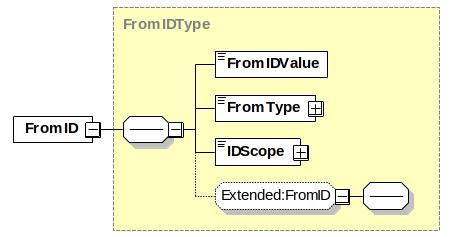

#### FromType

*FromTypeType*

Defines the type of a “From” connection used in a procedural logic definition.  

This may be either a standard type or an application specific extended type.

Standard enumerations are: 

- Step
- Transition
- Link
- Other

If “Other” then the type is an application specific extension and the value is defined in the attribute “OtherValue”.

#### IDScope

*IDScopeType*

Defines the scope of an ID in a link reference in a procedural logic definition. 

This may be either a standard type or an application specific extended type.

Standard enumerations are: 

- External - The link reference is to an element that is not within the list procedural logic elements, it is an external procedural entity (e.g. within a different RecipeElement).
- Internal - The link reference is to an element in the current procedural element list.
- Other - the type is an application specific extension and the value is defined in the attribute “OtherValue”.

#### ID

*IDType*

A string containing an identification of an element.

#### IndividualApproval

*IndividualApprovalType*

A description of an individual approval record, containing the approving entity, approval date, and description of the approval. 

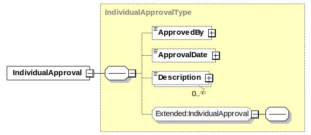

#### Link

*LinkType*

An identification of a link between procedural elements in procedure logic.
Flow of procedural control is assumed to flow from the “From” element to the “To” element.
EvaluationOrder is used to determine the current order of evaluation of transitions in selection branches. 

#### LinkType

*LinkTypeType*

An identification of the type of a link between procedural elements.  

This may be either a standard type or an application specific extended type.

Standard enumerations are: 

- ControlLink - Indicates a link that is a transfer of execution control (e.g. next step is a series of steps)
- TransferLink - The link indicates a transfer operation 
- SynchronizationLink - The link indicates synchronization between the elements. 
- ParallelDivergent - The link is part of a diverging parallel structure (e.g. one of multiple links from one transition to a set of parallel steps)
- ParallelConvergent - The link part of a converging parallel structure (e.g. one of multiple links from steps to a single transition that ends a set of parallel steps).
- SerialDivergent - The link is part of a diverging selection structure (e.g. one of multiple links from one step to multiple transitions, defining a selection branch).
- SerialConvergent - The link is part of a converging selection structure (e.g. one of multiple links from steps to a single transition that defines the end of selection branches). 
- Other - the type is an application specific extension and the value is defined in the attribute “OtherValue”.

#### ListHeader

*ListHeaderType*

Contains information about an element, such as an ID of the element, any version identification, an origin authority or system, the creation date of the element, and any modification logs available about the element. 


#### LotID

*LotIDType*

A string containing the identification of a material lot.

#### Max

*MaxType*

A float containing a maximum value. 

#### MemberEquipmentID

*MemberEquipmentIDType*

A string containing the identification of an equipment element in a class to instance association. 

#### Min

*MinType*

A float containing a maximum value.

#### Mode

*ModeType*

An identification of the mode of procedural elements.  
This may be either a standard type (ANSI/ISA-88) or an application specific extended type.

Standard enumerations are: 

- Automatic
- SemiAutomatic
- Manual
- Other

If “Other” then the type is an application specific extension and the value is defined in the attribute “OtherValue”.

#### ModificationLog

*ModificationLogType*

Defines a log of modifications to an element, including the date of the modification, a description of the modification, and the author making the modification.

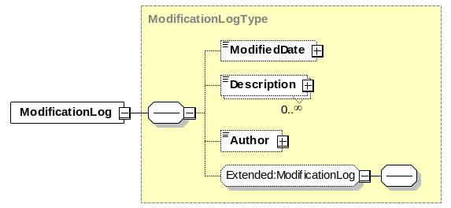

#### ModifiedDate

*ModifiedDateType*

A date/time of the modification of an element.

A specific instance on time using the ISA 8601 CE (Common Era) calendar extended format and abbreviated versions.

#### Nominal

*NominalType*

A float number defining a nominal value.

#### Note

*NoteType*

A string containing a note. 

#### OrderID

*OrderIDType*

A string containing the identification of the production order or customer order(s) with which this schedule record is related.

#### Origin

*OriginType*

A string containing an identification of the originating entity of an element.

#### OtherInformation

*OtherInformationType*

Defines additional information not specified in the standard. 

The meaning of the information is not specified in the exchange definition, but it is an agreement between the sender and receiver. This other information is usually extra documentation or descriptive information that may be needed in order to exchange a valid master recipe, but it is not information that is needed in order to execute the recipe.  Examples of other information may include compliance documentation, molecular structure diagrams or even pictures of the expected product.   

This follows the ANSI/ISA definition, however “other information” which can be defined using a commonly shared schema should be defined in the OtherInformation substitution group in the extensions schema.

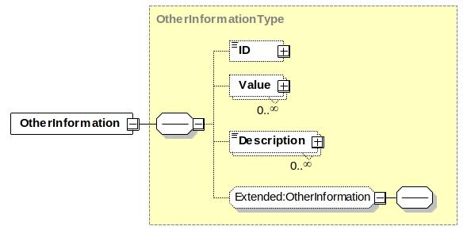

#### Parameter

*BatchParameterType*

Defines a parameter value used in a recipe, equipment, or batch list entry.  Each parameter has an ID, a type, and indication of scale, an application defined subtype, a scale reference, and may have a value. 


#### ParameterType

*ParameterTypeType*

An identification of the usage type of a parameter.  

This may be either a standard type (ANSI/ISA-88) or an application specific extended type.

Standard enumerations are:

- ProcessInput
- ProcessOutput
- ProcessParameter
- Other

If “Other” then the type is an application specific extension and the value is defined in the attribute “OtherValue”.

#### ParameterSubType

*ParameterSubTypeType*

A string used to enhance sorting and filtering of parameters.

#### ProcedureLogic

*ProcedureLogicType*

Defines the steps, transitions, and links that make up the procedural logic part of a recipe element.

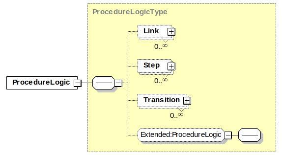

#### ProductID

*ProductIDType*

A string containing an identification of a product.  

Usually a product code.

#### ProductName

*ProductNameType*

A string containing a name of a product.  

Usually the trade or working name of the product. 

#### Property

*EquipmentElementPropertyType*

A property of an element, such as a property of an equipment element (MaximumTemperature of a unit).  

The property contains identification, a description and a value.  A property may contain sub properties. 

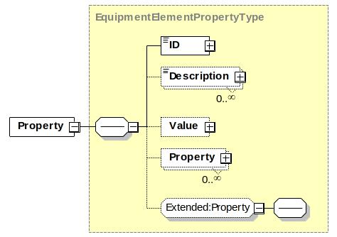

#### RecipeElement

*RecipeElementType*

Defines a recipe element, which may be a procedure, unit procedure, operation, phase, or a user defined type. 

[recipe element element](elements/recipe-element-element.jpg)

#### RecipeElementID

*RecipeElementIDType*

A string containing an identification of a recipe element, usually a procedure, unit procedure, operation, or phase. 

#### RecipeElementType

*RecipeElementTypeType*

An identification of the type of a recipe element.  

This may be either a standard type (ANSI/ISA-88) or an application specific extended type.

Standard enumerations are: 

- Procedure
- UnitRecipe
- UnitProcedure
- Operation
- Phase
- Allocation
- Deallocation
- Begin
- End
- Other

If “Other” then the type is an application specific extension and the value is defined in the attribute “OtherValue”.

#### RecipeElementVersion

*RecipeElementVersionType*

A string containing the version of a recipe element. 

#### RecipeID

*RecipeIDType*

A string containing the ID of a recipe. 

#### RecipeVersion

*RecipeVersionType*

A string containing the version of a recipe.

#### RequestedBatchSize

*RequestedBatchSizeType*

A float containing the requested size of a batch.

#### RequestedStartTime

*RequestedStartTimeType*

A date/time defining the requested start time of a batch.

A specific instance on time using the ISA 8601 CE (Common Era) calendar extended format and abbreviated versions.

#### RequestedEndTime

*RequestedEndTimeType*

A date/time defining the requested end time of a batch.

A specific instance on time using the ISA 8601 CE (Common Era) calendar extended format and abbreviated versions.

#### Scaled

*ScaledType*

A Boolean that, if “True”, indicates that a parameter value should be scaled when a batch is scaled. 

#### ScaleReference

*ScaleReferenceType*

A float value that contains the scale reference size used for scaling (e.g. 50,000 KG). 

#### ScaledSize

*ScaledSizeType*

A float value that contains the scale factor for a batch size

#### ScheduleEndTime

*ScheduleEndTimeType*

A date/time that contains the scheduled ending time for a batch list element. 

A specific instance on time using the ISA 8601 CE (Common Era) calendar extended format and abbreviated versions.

#### ScheduleEntryNote

*ScheduleEntryNoteType*

A string that contains a note for operators with additional instructions or information for a batch list element. 

#### ScheduleStartTime

*ScheduleStartTimeType*

A date/time that contains the scheduled starting time for a batch list element. 

A specific instance on time using the ISA 8601 CE (Common Era) calendar extended format and abbreviated versions.

#### StartCondition

*StartConditionType*

Defines an expected starting condition for a batch list entry element.  

The format of the condition is not defined. (e.g., "Starts before...", "Must Follow...").  

#### Status

*BatchStatusType*

An identification of the type of an element’s status.  

This may be either a standard type (ANSI/ISA-88) or an application specific extended type.

Standard enumerations are:

- Idle
- Running
- Complete
- Pausing
- Paused
- Holding
- Held
- Restarting
- Stopping
- Stopped
- Aborting
- Aborted
- Other

If “Other” then the type is an application specific extension and the value is defined in the attribute “OtherValue”.

#### Step

*StepType*

Defines a step in a recipe’s procedural logic.  This includes an ID of the step and an identification of the recipe element the step references.

#### ToEquipmentID

*ToEquipmentIDType*

A string containing an identification of the “To” equipment in an equipment connection. 

#### ToID

*ToIDType*

An identification of a step or transition in the link in a procedure link.

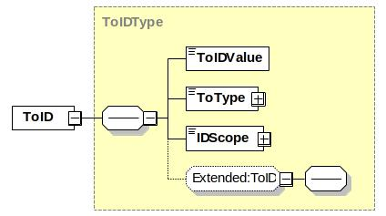

#### ToType

*ToTypeType*

Defines the type of a “To” connection used in a procedural logic definition.  

This may be either a standard type (ANSI/ISA-88) or an application specific extended type.

Standard enumerations are: 

- Step
- Transition
- Link
- Other

If “Other” then the type is an application specific extension and the value is defined in the attribute “OtherValue”.

#### Transition

*TransitionType*

Defines a transition in procedural logic.  Includes an identification of the transition, how the transition should be depicted in a procedure logic diagram, and the actual transition condition.


#### UnitOfMeasure

*UnitOfMeasureType*

A string containing a unit of measure.  Standard units of measure are not defined in this standard, but ISO standards should be used when applicable.  Defined in [B2MML Common Types](../B2MML-Common).

#### Value

*BatchValueType*

Defines a value, including how the value should be interpreted, the data type of the value, and the unit of measure of the value.

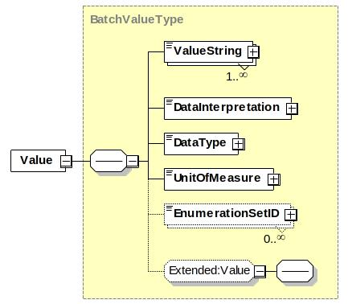

#### ValueString

*ValueStringType*

A string containing the actual value of a value. 

#### Version

*VersionType*

A string containing a version identification of an element.  

For example V1.0.  Defined in [B2MML Common Types](../B2MML-Common).

#### VersionDate

*VersionDateType*

A date/time of the version of an element. 

A specific instance on time using the ISA 8601 CE (Common Era) calendar extended format and abbreviated versions.
