# BatchML - Batch Production Record

The Business To Manufacturing Markup Language (B2MML) is used courtesy of MESA International.

## Diagram Convention

[see here](../diagram-convention)

## Schema Scope

[BatchML-BatchProductionRecord.xsd](../../../Schema/BatchML-BatchProductionRecord.xsd)

This document provides explanatory information about the referenced MESA XML schemas used to exchange information about batch production records, called the Batch Markup Language, or BatchML.  

This information is based on the data models and attributes defined in the ANSI/ISA 88.00.04 Batch Production Record Information. Contact ISA (The Instrumentation, Systems, and Automation Society) for copies of the standard. Additional information on the standard is available at [www.isa.org](www.isa.org).

### Referenced Schemas

This document provides addresses the contents of the following MESA XML schema [BatchML-BatchProductionRecord.xsd](../../../Schema/BatchML-BatchProductionRecord.xsd)

### Key Use Assumptions

The schemas define exchanged information and do not define the use of the information or encapsulation of the information in any defining transactions.  These schemas are intended to be used to create XML documents used to exchange batch data as well as serve as the basis for corporate, system or application specific schemas that may be derived from the BatchML schemas.  

### Key Information Assumptions

The schemas define simple and complex types and elements for recipe, equipment and batch list data commonly found in batch applications.  A set of data models is presented for recipes, equipment and batch lists.  Each model also illustrates the equivalent top-level XML elements that correspond to top-level objects identified in the ANSI/ISA-88 standard.  The details of the schema element and attribute definitions are contained in later sections of this document. 

### Common Data Types

The BatchML BatchInformation schema used the B2MML Common schema to pick up common data types. 
See the documentation for the Common Types: [B2MML-Common](../B2MML-Common)

### Core Components

The BatchML BatchInformation schema used the B2MML Core Component schemas. 

The base types for most elements are derived from core component types that are compatible with the UN/CEFACT core component types.  The UN/CEFACT core component types are a common set of types that define specific terms with semantic meaning (e.g. the meaning of a quantity, currency, amount, identifier …).  The UN/CEFACT core components were defined in a Core Components Technical Specification (CCTS) developed by the ebXML project now organized by UN/CEFACT and ISO TC 154. 

The core components are defined in the schema file: [B2MML-CoreComponents.xsd](../B2MML-CoreComponents.xsd)

## Schema Organization

### BatchProductionRecord Element

The BatchML root element is BatchProductionRecord.  

### Type Names

The XML schema uses a model that defines simple and complex data types for each element.  The data types all follow the convention of a suffix of “Type” added to the element name.   

````xsd
<xsd:element name = "ApprovalDate"  type = "ApprovalDateType">

<xsd:simpleType name="ApprovalDateType">
       <xsd:restriction base="xsd:dateTime">
       </xsd:restriction>
 </xsd:simpleType>

````

### User Element Extensibility

In order to make the schemas more useful, they include the ability for elements to be extended.  The extended elements are not defined in this standard and should not be considered understandable between applications without prior agreement.   

See the definition of user extensions in [B2MML-Extensions](../B2MML-Extensions)

## Batch production record Models

The exchanged information is derived from the UML models below. 

NOTE: This version has used the ANSI/ISA 95.02-2010 definition for the ISA 95 data elements.  The data definitions in ANSI/ISA 88.04 have been extended to include the following:

1. Addition of the OperationsDefinition schema definition. 
2. Addition of the OperationsPerformance schema definition.
3. Addition of the OperationsSchedule schema definition.
4. Addition of PhysicalAssetIDs where ever EquipmentIDs are defined. 
5. Addition of ResourceUse and ResourceType elements in a ResourceQualificationManifest to match the ISA 95 resource use and resource type definitions.  
6. Addition of ANSI/ISA 95 Part 4 Work Masters, Work Directives, Work Schedule, and Work Response models.

### 3.1 Batch production record

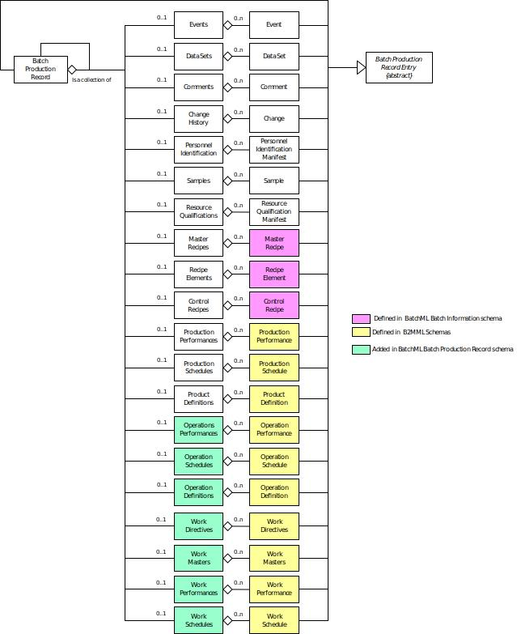

A batch production records is made up of multiple sub-records acting as container objects.  These are represented as XML elements.  Each sub-record is a collection of similarly typed individual records.  

A Batch Production Record may also contain another Batch Production Record.  

This is the UML model derived from ANSI/ISA-88.04 and ANSI/ISA95.02-2010. Each of the sub-record container elements contains a collection of zero or more individual records.  These are modeled in BatchML as XML elements within the sub-record elements. 

All of the individual records are specialized types derived from a Batch Production Record Entry abstract type.  This is modeled in BatchML using the “group” **BatchProductionRecordEntryType** element that is included as the initial element in each of the individual records.

### Records with references to other records

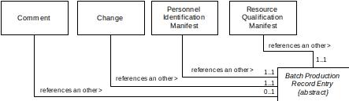

*the UML model from ANSI/ISA-88.04*

The following four individual records may reference another records;
- comments
- personnel identification manifest
- qualification manifest
- and change history.

These are modeled in UML.

These are modeled as a **RecordReference** element, which is defined as a Core Component **IdentifierType**.  This should contain the EntryID value of the referenced value. 

Example 1: The EntryID contains an XPath specification string that identifies the element in the XML record. 

Example 2: The EntryID contains a unique number that for each element. 

### Event model

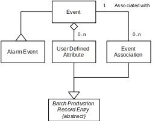

*the UML model from ANSI/ISA-88.04*

An event is a discrete occurrence in time.  There are different types of event objects and each event is identified by an event type and subtype.  Some event objects may be associated with other events, these are modeled as a **RecordReference** element, which is defined as a Core Component **IdentifierType**.  This should contain an XPath specification string that identifies the element in the XML record.    

Events contain user defined records, may contain alarm event information and a set of event associations.  User defined attributes are also derived from the Batch Production Record Entry type.

### Sample model

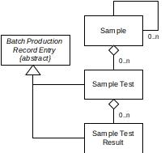

*the UML model from ANSI/ISA-88.04*

Samples contain Sample Tests, and Sample Tests contain Sample Test Results.  Sample Tests and Sample Test Results are also derived from the Batch Production Record Entry type.

### Data set model

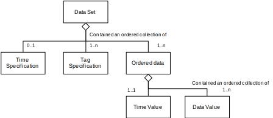

*the UML model from ANSI/ISA-88.04*

Data sets are used to represent multivariable data sets or time based data sets.

The sets contain ordered data sets.
The ordered data set is modeled using a “choice” element as either:

1. A Delimited data block in which the data sets are recorded in a single delimited string, with the delimiting characters defined in the DelimitedDataBlockType.
2. As a set of OrderedDataType elements.  Each OrderedDataType contains an optional time element and a set of data elements.

### Master recipe, control recipes, and recipe procedure elements

The master recipe, control recipe, and recipe procedure elements are defined in ANSI/ISA-88.01 standard.

The Batch Production Record schema uses the element definitions defined in [BatchML-BatchInformation.md](../BatchML-BatchInformation)

The Batch Production Record schema uses the schema definitions from the BatchML file [BatchML-BatchInformation.xsd](../../../Schema/BatchML-BatchInformation.xsd)

### Operations elements

The production request, production response, and product definition elements are defined in the ANSI/ISA-95.02 standard. 

|                           | document                                                          | schema |
|---------------------------|-------------------------------------------------------------------|--------|
| operations definition     |[B2MML-OperationsDefinition.md](../B2MML-OperationsDefinition)     |[B2MML-OperationsDefinition.xsd](../../../Schenma/B2MML-OperationsDefinition.xsd)
| operations perfromance    |[B2MML-OperationsPerformance.md](../B2MML-OperationsPerformance)   |[B2MML-OperationsPerformance.xsd](../../../Schema/B2MML-OperationsPerformance.xsd)
| operations schedule       |[B2MML-OperationsSchedule.md](../B2MML-OperationsSchedule)         |[B2MML-OperationsSchedule.xsd](../../../Schema/B2MML-OperationsSchedule.xsd)

### Production elements

The production request, production response, and product definition elements are defined in the ANSI/ISA-95.02 standard.

|                           | document                                                          | schema |
|---------------------------|-------------------------------------------------------------------|--------|
|product definition         |[B2MML-ProductDefinition.md](../B2MML-ProductDefinition)           |[B2MML-ProductDefinition.xsd](../../../Schema/B2MML-ProductDefinition.xsd)
|production performance     |[B2MML-ProductionPerformance.md](../B2MML-ProductionPerformance)   |[B2MML-ProductionPerformance.xsd](../../../Schema/B2MML-ProductionPerformance.xsd)
|production schedule        |[B2MML-ProductionSchedule.md](../B2MML-ProductionSchedule)         |[B2MML-ProductionSchedule.xsd](../../../Schema/B2MML-ProductionSchedule.xsd)


### Work elements

The production request, production response, and product definition elements are defined in the ANSI/ISA-95.04 standard.

|                           | document                                                          | schema |
|---------------------------|-------------------------------------------------------------------|--------|
| work definition           |[B2MML-WorkDefinition.md](../B2MML-WorkDefinition)                 |[B2MML-WorkDefinition.xsd](../../../Schema/B2MML-WorkDefinition.xsd)
| work performance          |[B2MML-WorkPerformance.md](../B2MML-WorkPerformance)               |[B2MML-WorkPerformance.xsd](../../../Schema/B2MML-WorkPerformance.xsd)
| work schedule             |[B2MML-WorkSchedule.md](../B2MML-WorkSchedule)                     |[B2MML-WorkSchedule.xsd](../../../Schenma/B2MML-WorkSchedule.xsd)

## Element Definitions

The term BatchProductionRecord is shorted to BPR in the descriptions. 

### Transactions

The ANSI/ISA88-04 standard does not define transactions for Batch Production Records.  BatchML defines a set of standard transactions based on the ISA-95.05 Business to Manufacturing Transaction standards.  See ANSI/ISA95.05 or IEC 62264-5 for further details on transactions. 

The following top level elements for transactions are defined:

#### GetBatchProductionRecord

Defines a message used to implement a GET action on a BPR.

- BPR ID specified: Defines a request that the receiver is to return, in a SHOW message, all attributes and contained elements of the BPR that matches the ID for the specified equipment scope.
- Wildcard BPR ID specified: Defines a request that the receiver is to return, in a SHOW message, all attributes and contained elements of all BPRs that match the ID wildcard for the specified equipment scope. 
- No BPR ID Specified: Apply the additional constraints.
- One or more of the following constraints may apply: 
    - CreationDate specified: Defines a request that the receiver is to return, in a SHOW message, BPRs with the specified creation date for the specified equipment scope.
    - BatchProductionRecordSpec specified: Defines a request that the receiver is to return, in a SHOW message, BPRs created with the BatchProductionRecordSpec for the specified equipment scope.
    - BatchID specified: Defines a request that the receiver is to return, in a SHOW message, BPRs with the specified BatchID for the specified equipment scope. 
    - CampaignID specified: Defines a request that the receiver is to return, in a SHOW message, BPRs with the specified CampaignID for the specified equipment scope. 
    - ExpirationDate specified: Defines a request that the receiver is to return, in a SHOW message, BPRs with the specified ExpirationDate for the specified equipment scope. 
    - LastChangedDate specified: Defines a request that the receiver is to return, in a SHOW message, BPRs with the specified LastChangedDate for the specified equipment scope. 
    - LotID specified: Defines a request that the receiver is to return, in a SHOW message, BPRs with the specified LotID for the specified equipment scope. 
    - MaterialDefinitionID specified: Defines a request that the receiver is to return, in a SHOW message, BPRs with the specified MaterialDefinitionID for the specified equipment scope. 
    - RecordStatus specified: Defines a request that the receiver is to return, in a SHOW message, BPRs with the specified RecordStatus for the specified equipment scope. 
    - Version specified: Defines a request that the receiver is to return, in a SHOW message, BPRs with the specified Version for the specified equipment scope.

#### ShowBatchProductionRecord

Response from a GetBatchProductionRecord transaction.

#### ProcessBatchProductionRecord

Defines a request that the receiver is to add a new BPR. Any assigned IDs in the BPR are returned in the **AcknowledgeBatchProductionRecord** message.

#### AcknowledgeBatchProductionRecord

Response to a **ProcessBatchProductionRecord** transaction.

#### ChangeBatchProductionRecord

Defines a request to change information in a BPR, replacing the existing information with the information in the transaction message.

#### RespondBatchProductionRecord

Response to the **ChangeBatchProductionRecord** transaction. 

#### CancelBatchProductionRecord

Defines a request to cancel a BPR.  

#### SyncBatchProductionRecord

Defines a received message that may contain a new, changed, or deleted BPR. 

### BatchProductionRecordEntryType Group

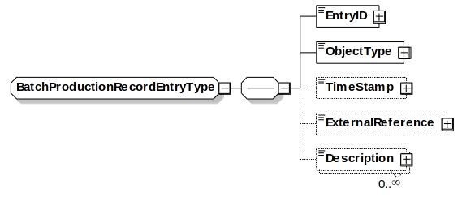

BatchProductionRecordEntryType is a group definition that is included in most of the other BatchProductionRecord elements.

It contains the following element types:

#### Entry ID

*IdentifierType*

A unique identification of the BPR individual element.  This element is mandatory.  

#### ObjectType

*RecordObjectTypeType*

Identifies the type of object an entry is based upon. This element is mandatory. 

This may be either a standard type or an application specific extended type.  Standard enumerations correspond to the BPR element types and are: 

- Batch Production Record 
- Change
- Comment 
- Control Recipe 
- Data Set 
- Event 
- Master Recipe 
- Operations Definition 
- Operations Performance 
- Operations Schedule 
- Product Definition 
- Production Performance 
- Production Schedule 
- Personnel Identification Manifest 
- Resource Definition Manifest 
- Recipe Element 
- Sample 
- Sample Test 
- Sample Test Result 
- Work Directive
- Work Master
- Work Performance 
- Work Schedule 
- Other

If “Other” then the type is an application specific extension and the value is defined in the attribute “OtherValue”.

#### TimeStamp

*DateTimeType*

The optional time stamp associated with the entry.

#### ExternalReference

*IdentifierType*

Contains an optional reference to data which is stored external to the BPR.

#### Description

*DescriptionType*

Additional optional additional information about the BPR.

### Batch Production Record Element

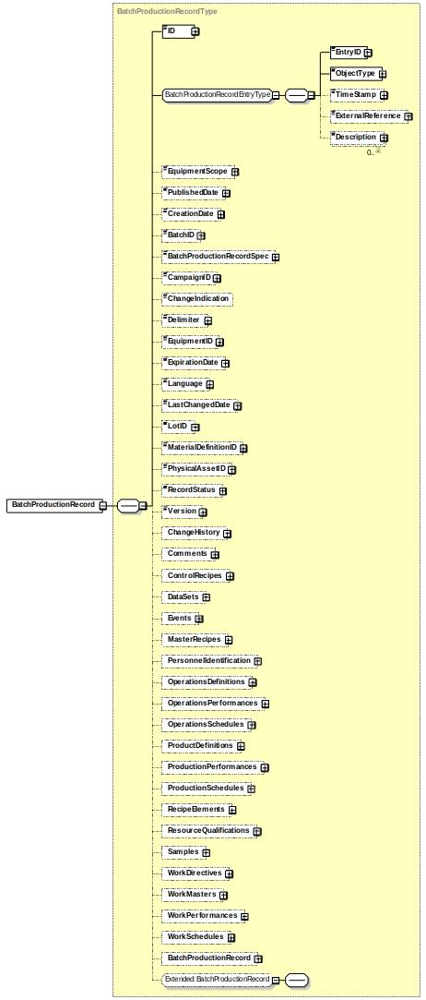

A top level element is a **BatchProductionRecord** element or type **BatchProductionRecordType**.

It contains the following element types:

#### ID

*IdentifierType*

A unique identification of the BPR.  This element is mandatory.  

#### ObjectType

*RecordObjectTypeType*

Identifies the type of object an entry is based upon.

#### TimeStamp

*DateTimeType*

The time stamp associated with the entry.

#### ExternalReference

*IdentifierType*

Contains a reference to data which is stored external to the BPR.

#### Description 

*DescriptionType*

Additional information about the BPR.

#### EquipmentScope

*IdentifierType*

The equipment hierarchy scope of the data associated with BPR. 

This information represents the physical structure of the BPR to identify its context within the plant physical hierarchy

#### PublishedDate

*DateTimeType*

The date the BPR was published.

#### CreationDate

*DateTimeType*

The date the BPR was created.

#### BatchID

*IdentifierType*

The list of IDs of the batches associated with the BPR.

#### BatchProductionRecordSpec

*IdentifierType*

An optional identification of the Batch Production Record Specification that was used to generate the BPR. The format for this specification is not defined. 

#### CampaignID

*IdentifierType*

An optional identification of the campaign associated with the BPR.

#### ChangeIndicator

*xsd:string*

An optional indication enabling detection that the batch production record has not been altered.  

- Example 1: 	A string generated by an MD5 algorithm used as a hashing algorithm.
- Example 2: 	A string representing a digital key of the entire batch production record.
- Example 3: 	A string representing a checksum of the entire batch production record.

#### Delimiter

*TextType*

Delimiter character used to separate equipment elements in the EquipmentID and PhysicalAssetID elements.  Example: “\”

#### EquipmentID

*IdentifierType*

A definition of the equipment associated with the BPR. 

#### ExpirationDate

*DateTimeType*

The Date and time at which the batch production record is no longer relevant.

#### Language

*CodeType*

The overall language used in the BPR.  Note that and DescriptionType or TextType have an optional Language attribute. 
Language codes should be specified using the ISO 639: 1988 specification.  

#### LastChangedDate

*DateTimeType*

The date the BPR was last changed.

#### LotID

*IdentifierType*

The list of IDs of the lots associated with the BPR.  

#### MaterialDefinitionID

*IdentifierType*

The list of IDs of the Material Definitions associated with the BPR.

#### PhysicalAssetID

*IdentifierType*

A definition of the physical asset associated with the BPR. 

#### RecordStatus

*CodeType*

Specifies the current status of the BPR, reflecting the current position in the BPRs life cycle.  There are no standard codes defined.
Example: In Process, In Review, Approved. 

#### Version

*IdentifierType*

The current version of the BPR.

#### ChangeHistory

*ChangeHistoryType*

Container type for Change elements.

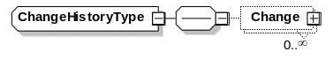

#### Comments

*CommentsType*

Container type for Comment elements. 


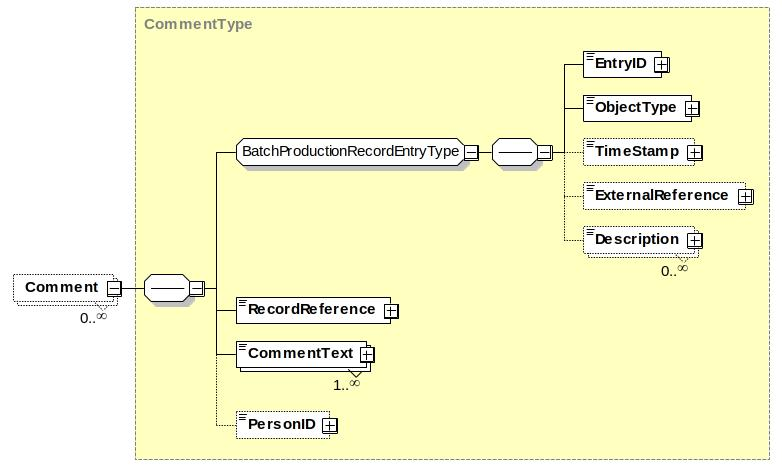

#### ControlRecipes

*ControlRecipeType*

Container type for Control Recipe elements. 

See [BatchML-BatchInformation.md](../BatchML-BatchInformation) for a specification of the ControlRecipe element type.

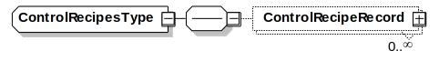

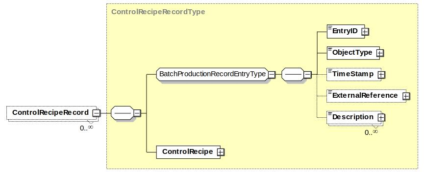

#### DataSets

*DataSetsType*

Container type for DataSet elements. 


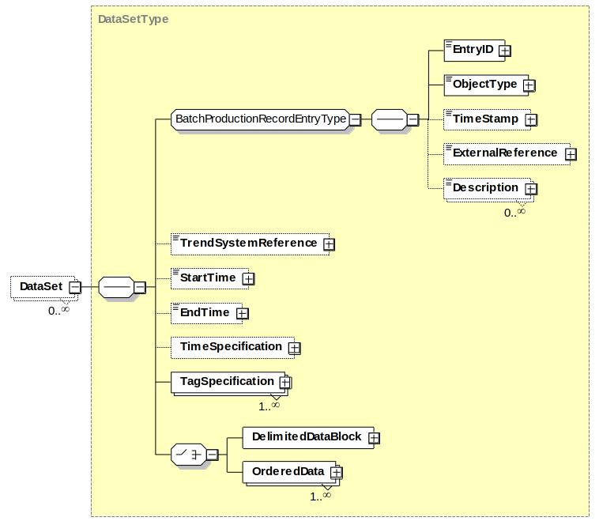

#### Events

*EventsType*

Container type for Event elements. 


#### MasterRecipes

*MasterRecipesType*

Container type for MasterRecipe elements. 

See [BatchML-BatchInformation.md](../BatchML-BatchInformation) for a specification of the MasterRecipe element type.


#### PersonnelIdentification

*PersonnelIdentificationType*

Container type for PersonnelIdentificationManifest elements.


#### OperationsDefinitions

*OperationsDefinitionsType*

Container type for OperationsDefinition elements.

See [B2MML-OperationsDefinition.md](../B2MML-OperationsDefinition) for a specification of the OperationsDefinition element type.

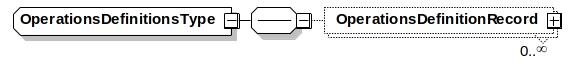

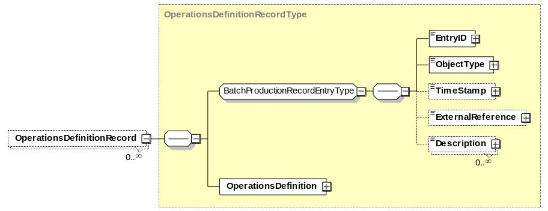

#### OperationsPerformances

*OperationsPerformancesType*

Container type for OperationsPerformance elements.

See [B2MML-OperationsPerformance.md](../B2MML-OperationsPerformance) for a specification of the OperationsPerformance element type.

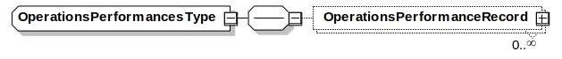

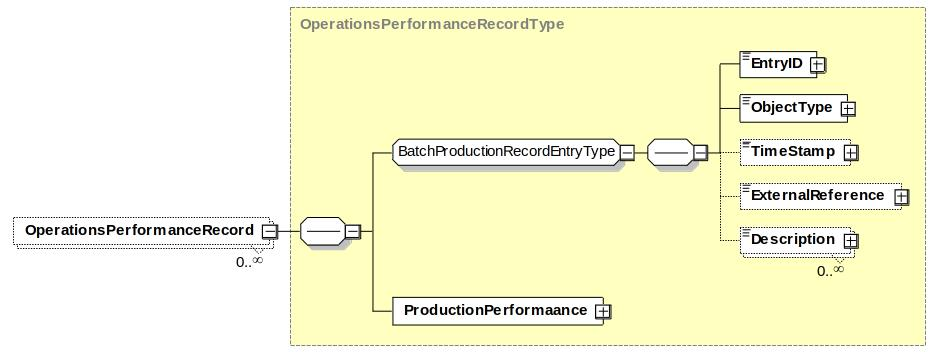

#### OperationsSchedules

*OperationsSchedulesType*

Container type for OperationsSchedule elements.

See [B2MML-OperationsSchedule.md](../B2MML-OperationsSchedule) for a specification of the OperationsSchedule element type.

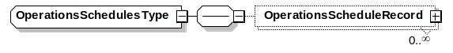


#### ProductDefinitions

*ProductDefinitionsType*

Container type for ProductDefinition elements.

See [B2MML-ProductDefinition.md](../B2MML-ProductDefinition) for a specification of the ProductDefinition element type.


#### ProductionPerformances

*ProductionPerformancesType*

Container type for ProductionPerformance elements. 

See [B2MML-ProductionPerformance.md](../B2MML-ProductionPerformance) for a specification of the ProductionPerformance element type.

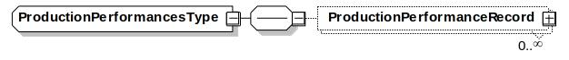


#### ProductionSchedules

*ProductionSchedulesType*

Container type for ProductionSchedule elements.

See [B2MML-ProductionSchedule](../B2MML-ProductionSchedule) for a specification of the ProductionSchedule element type.

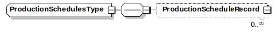


#### RecipeElements

*RecipeElementsType*

Container type for RecipeElement elements.

See [BatchML-BatchInformation.md](../BatchML-BatchInformation) for a specification of the RecipeElement element type.

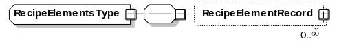

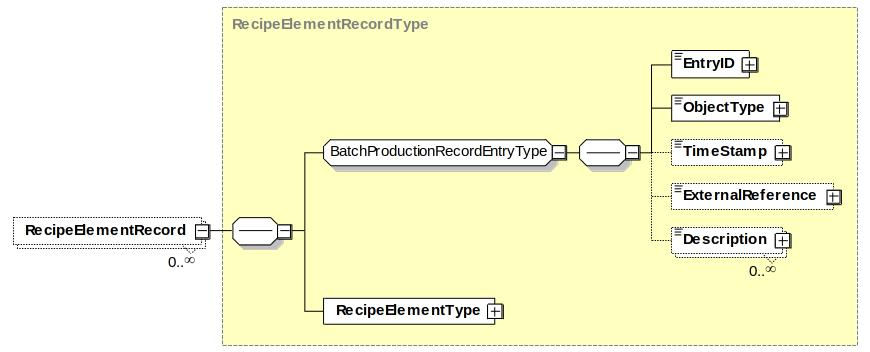

#### ResourceQualifications

*ResourceQualificationsType*

Container type for ResourceQualificationManifest elements.

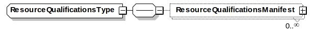

#### Samples

*SamplesType*

Container type for Sample elements.

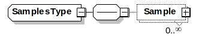

#### BatchProductionRecord

*BatchProductionRecordType*

Contained BPR. 

#### WorkMaster

*WorkMasterRecordType*

Container type for Work Master elements


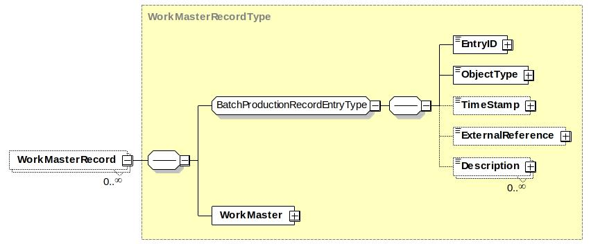

#### WorkDirective

*WorkDirectiveRecordType*

Container type for Work Directive elements


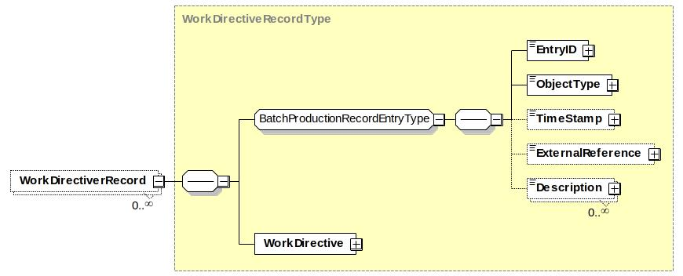

#### WorkSchedule

*WorkScheduleRecordType*

Container type for Work Schedule elements


#### WorkPerformance

*WorkPerformanceRecordType*

Container type for Work Performance elements


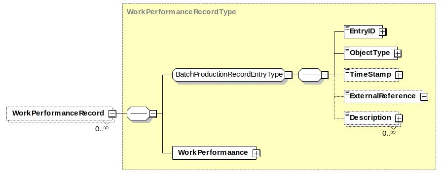

### Data Elements

#### AlarmData

*AlarmDataType*

Defines additional alarm data for an event that is an alarm event.

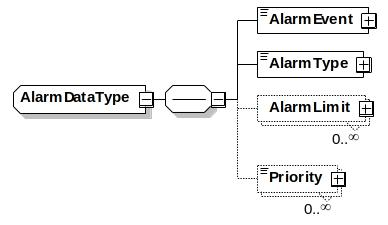

##### AlarmEvent

*CodeType*

Defines the type of alarm event. Standard identifiers are not defined.  Examples: Detected, Acknowledged, and Cleared.

##### AlarmType

*CodeType*

Defines the type of alarm. Standard identifiers are not defined.  Examples: High, Deviation, Rate of Change.

##### AlarmLimit

*ValueType*

Defines the value measurement that caused the alarm event. 

##### Priority

*IdentifierType*

Defines the importance of the event.  Standard identifiers are not defined.  Examples: High, Low, 10, 9,8, 0 …

#### Change

*ChangeType*

A specification of a change to a BPR element.

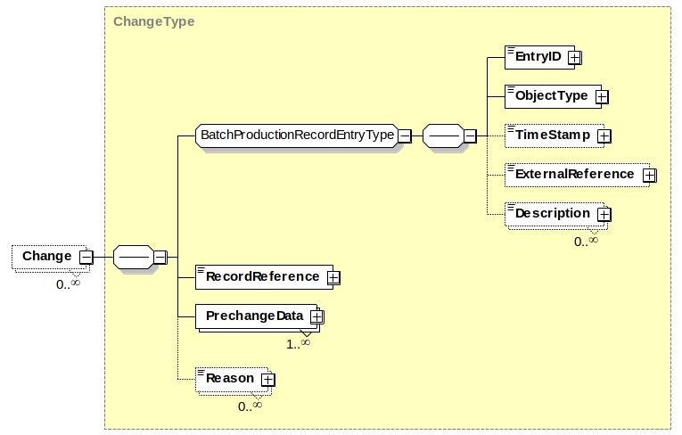

Each Change element contains:

##### RecordReference

*IdentifierType*

The EntryID of a specific element in the BPR.

##### PreChangeData

*ValueType*

A definition of the value of a data element prior to change of the data element.

##### Reason

*TextType*

A text comment with the reason for the change.

#### Comment

*CommentType*

A comment related to a BPR element.


Each Comment element contains:

##### RecordReference

*IdentifierType*

The EntryID of a specific element in the BPR.

##### CommentText

*TextType*

The text comment.

##### PersonID

*NameType*

Defines the person associated with the comment.

#### DataSet

*DataSetType*

A data set defines arrays of related data values that can be used to represent time series or correlated data values.


Each DataSet element contains:

##### TrendSystemReference

*IdentifierType*

Specifies the location of the data set if is stored on an external system.

##### StartTime

*DateTimeType*

Date and time of the start of data in the data set.

##### EndTime

*DateTimeType*

Date and time of the end of data in the data set.

##### TimeSpecification

*TimeSpecificationType*

Defines the attributes of the time specification of the data. 

##### TagSpecification

*TagSpecificationType*

##### DelimitedDataBlock

*DelimitedDataBlockType*

##### OrderedData

*OrderedDataType*

#### DataValue

*DataValueType*

Defines the value for a data element in a data set.

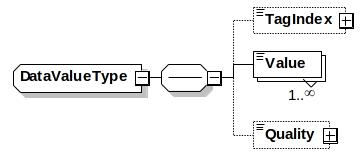

##### TagIndex

*NumericType*

Defines a numeric index value the Tag element.

NOTE: This is required because the order of repeating elements is not guaranteed in XML.

##### Value

*xsd:string*

Defines the value of the data for a tag for a data set.

##### Quality

*IdentifierType*

Defines the quality of the value.  This indicates the lack or presence of problems associated with the collection of the data.  There are no standard identifiers defined.  Example: Good, Uncertain, Out of Date. 

#### DelimitedDataBlock 

*DelimitedDataBlockType*

Defines a data set in a single delimited string element. The string contains a set of substrings, delimited by the OrderDelimiter, and tag elements in the substring delimited by the TagDelimiter.  The selection of the TagDelimiter and OrderDelimiter will be dependent on the data collected. The delimiter characters cannot be part of the data. 

Note: This data representation is not directly defined in ANSI/ISA 88.04, but is provided to have a more compact form of data representation. 

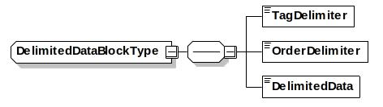

##### TagDelimiter

*()*

Defines the character used to delimit the tag elements within an Order substring.

Example: “\”.  

##### OrderDelimiter

*()*

Defines the character used to delimit the order substrings.

Example “|”. 

##### DelimitedData

*()*

Defines the delimited string with tag elements.

Example: 
“09:10:21\23.4\57\76.2|09:10:25\23.3\57\76.1|09:10:27\23.2\57\76.0”

Empty tag data values are indicated by no spaces between TagDelimiters. 

#### Event

*SingleEventType*

Describes an event.

The event contains an EventType, EventSubType,,and value. The associated meaning of the event type, subtype, value, and previous value are specified in ANSI/ISA 88.04 and IEC 61512-4. 

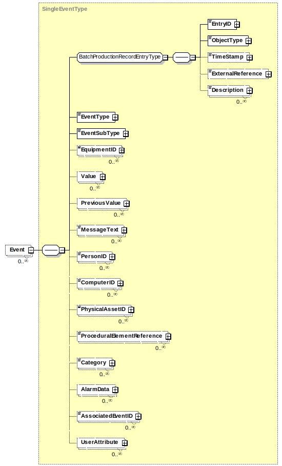

Other elements include:

##### EquipmentID

*IdentifierType*

Defines the equipment associated with the event. 

##### MessageText

*TextType*

Defines text associated with the event. 

##### PersonID

*NameType*

Defines an identification of the person associated with the event.

##### ComputerID

*IdentifierType*

Defines the computer or automation system associated with the event. 

##### PhysicalAssetID

*IdentifierType*

Defines the physical asset associated with the event.

##### ProceduralElementReference

*IdentifierType*

Defines a reference to a procedural element associated with the event, such as a phase or an operation in a control recipe.

##### Category

*IdentifierType*

Defines the use category of the event. No standard identifiers are defined.

Example; Informational, Critical. 

##### AlarmData

*AlarmDataType*

Defines additional alarm data if the event is an alarm type.

##### AssociatedEventID

*IdentifierType*

Defines the EntryID of any associated event. 

##### UserAttribute

*UserAttributeType*

Defines additional user defined attributes associated with the event. 

#### EventSubType

*EventSubTypeType*

Defines an event subtype.
The associated meaning of the event type, subtype, value, and previous value are specified in ANSI/ISA 88.04 and IEC 61512-4.
This may be either a standard type or an application specific extended type.  Standard enumerations correspond to the BPR element types and are:

- Allocation
- Application
- Consume
- Deallocation
- Equipment
- Message
- Mode Change
- Mode Command
- Modification
- Movement
- Parameter Data
- Process
- Process Data
- Produce
- Prompt
- Prompt Response
- Property Value Change
- Reconciliation
- Security
- State Change
- State Command
- Status Change
- System
- Target End Time
- Target Start Time
- Other

If “Other” then the type is an application specific extension and the value is defined in the attribute “OtherValue”.

#### EventType

*EventTypeType*

Defines an event type. The associated meaning of the event type, subtype, value, and previous value are specified in ANSI/ISA 88.04 and IEC 61512-4.
This may be either a standard type or an application specific extended type.  Standard enumerations correspond to the BPR element types and are:

- Alarm
- Control Recipe
- Equipment
- General
- Material
- Message
- Operator
- Procedural Execution
- Other

If “Other” then the type is an application specific extension and the value is defined in the attribute “OtherValue”.

##### OrderedData

*OrderedDataType*

Defines a set of ordered data values.  

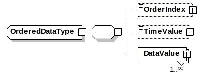

##### OrderIndex

*NumericType*

Defines a numeric index value the OrderedData element if there is not TimeValue defined.

NOTE: This is required because the order of repeating elements is not guaranteed in XML.

##### TimeValue

*DateTimeType*

Defines the date and time of the OrderedData element if it is time base. 

##### DataValue

*DataValueType*

Defines the value of the data, 

#### PersonnelIdentificationManifest

Defines the identification of a person associated with a BPR element.

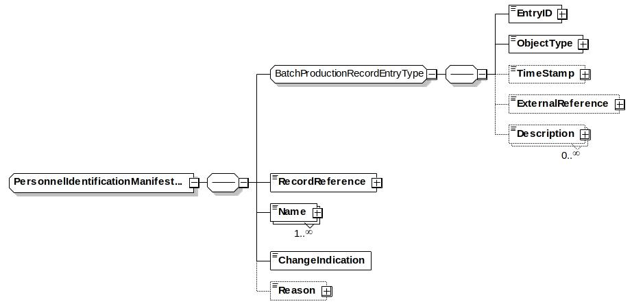

##### RecordReference

*IdentifierType*

Defines the EntryID of a record in the BPR that the personnel identification manifest is associated with, for example a Change element. 

##### Name

*NameType*

Defines the name of the person.

##### ChangeIndication

*xsd:string*

An indication enabling detection that the PersonnelIdentificationManifest element has not been altered.

Example: string generated by an MD5 hash algorithm of the name, record reference, and reason. 

##### Reason

*TextType*

Defines the reason for the signature. 

#### ResourceQualificationManifest

Defines the identification of a resource associated with a BPR element.

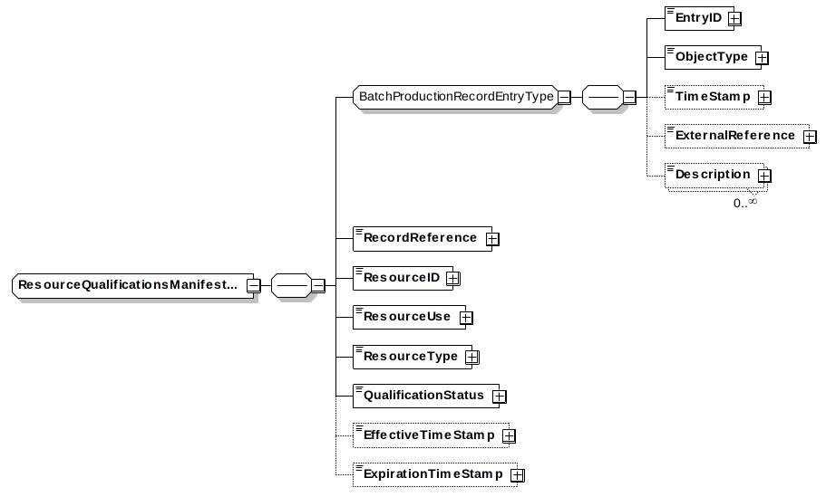

##### RecordReference

*IdentifierType*

Defines the EntryID of a record in the BPR that the resource qualification manifest is associated with

##### ResourceID

*IdentifierType*

Defines the resource associated with the BPR element. 

##### QualificationStatus

*CodeType*

Defines the criteria of the resource that was recorded. No standard codes are defined.

Examples: Sterilized, Cleaned, Services. 

##### EffectiveTimeStamp

*DateTimeType*

Defines the date and time the qualification became effective

##### ExpirationTimeStamp

*DateTimeType*

Defines the date and time the qualification expired. 

#### Sample

*SampleType*

Defines that a material was sampled and/or tested and results of the test.

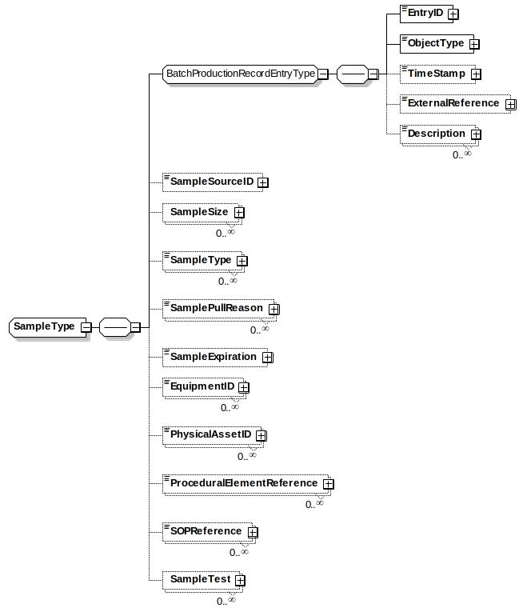

##### SampleSourceID

*IdentifierType*

Defines the lot, batch, or sample that the sample material was pulled from.

##### SampleSize

*QuantityValueType*

Defines the amount of material taken for the sample. 

##### SampleType

*CodeType*

Defines the type of sample pulled.

There are no standard codes defined.

Examples: Receiving Sample, Online Sample, Lab Sample,

##### SamplePullReason

*TextType*

Defines the reason the sample was pulled.

##### SampleExpiration

*DateTimeType*

Defines the date the sample expires.

##### EquipmentID

*IdentifierType*

Defines a reference to an equipment element that is associated with the sample.

Example: The Unit the sample was pulled from.

##### PhysicalAssetID

**IdentifierType*

Defines a reference to a physical asset element that is associated with the sample.  

##### ProceduralElementReference

*IdentifierType*

Defines a reference to procedural element, such as the phase in a control recipe, which is associated with the sample.

##### SOPReference

*IdentifierType*

Defines the standard operating procedure (SOP) that is associated with the sample pull.  

##### SampleTest

*SampleTestType*

Defines the tests on the sample.

#### SampleTest

*SampleTestType*

Defines information on a test of a sample.

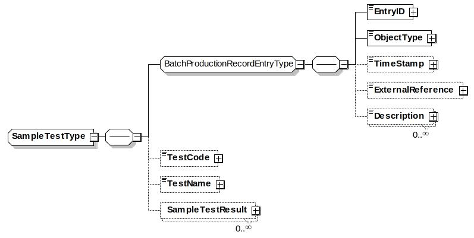

##### TestCode

*CodeType*

defines the test procedure used. Example: CHR3390

##### TestName

*IdentifierType*

Defines the name associated with the test performed.

Example: Bio Burden

##### SampleTestResult

*SampleTestResultType*

#### SampleTestResult

*SampleTestResultType*

Defines the result from a sample test.

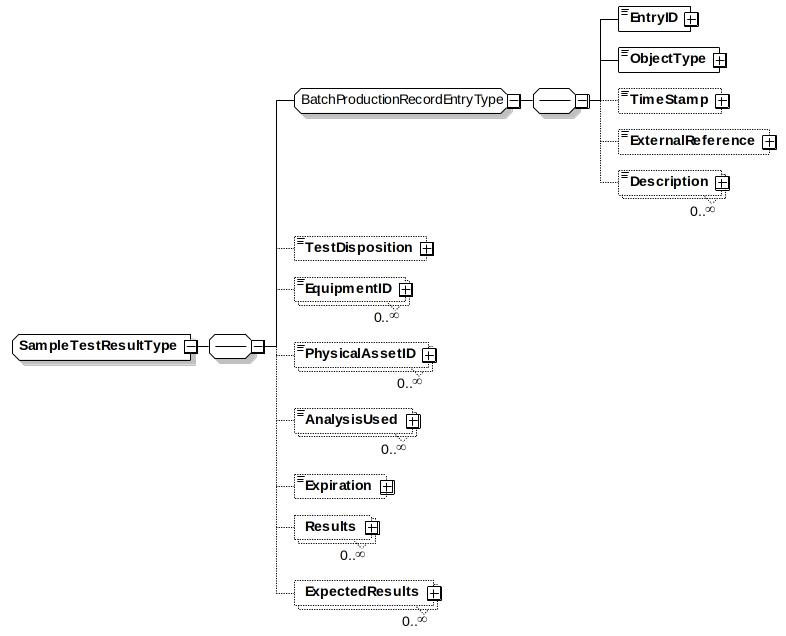

##### TestDisposition

*IdentifierType*

Defines an indication if the test results were acceptable.

No standard identifiers defined.

Example: Pass, Fail

##### EquipmentID

*IdentifierType*

Defines the equipment used to perform the tests.

##### PhysicalAssetID

*IdentifierType*

Defines the physical asset used to perform the tests.

##### AnalysisUsed

*CodeType*

Defines the statistical sampling analysis used to determine the result.  No standard CodeType is defined. Example: Average, Minimum, Maximum

##### Expiration

*DateTimeType*

Defines the date and time that the sample test results expire. 

##### Results

*ValueType*

Defines the actual value or values returned from the test.

##### ExpectedResults

*ValueType*

Defines the expected value or values returned from the test. 

#### TagSpecification 

*TagSpecificationType*

Defines a unique identification of a data source.

It contains the information to identify a single data source (called a tag) and any data required to interpret the data values, such as data compression information required to use the data.

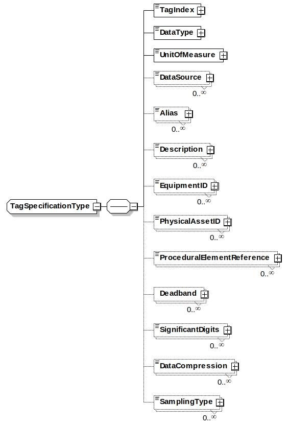

##### TagIndex

*NumericType*

An internal number that is used to identify the specific data value in a dataset. (Because the order of repeating elements in XML is not guaranteed, this number is used to tie the data value to the tag specification,)

##### DataType

*DataTypeType*

From the common elements, defines the data type of the data. (Example: long, unsignedInt, float,…)

##### UnitOfmeasure

*UnitOfMeasureType*

From the Common elements, defines the unit of measure as a CodeType.

##### DataSource

*IdentifierType*

Defines the data source for the data element, typically the tag name or equivalent. 

##### Alias

*IdentifierType*

Defines an alternate ID of the data source of the data element. 

##### Description

*DescriptionType*

Defines additional information about the data source or the alias identification.

##### EquipmentID

*IdentifierType*

Defines a reference to equipment, This information represents the physical structure above the referenced entity to identify its context within the plant physical hierarchy. 

##### PhysicalAssetID

*IdentifierType*

Defines a reference to a physical asset.

##### ProceduralElementReference

*IdentifierType*

Reference to the procedural element, such as procedure, unit procedure, operation, recipe phase, equipment phase, or equipment step associated with the data source ID for the time period of the trend segment.

##### Deadband

*ValueType*

A deadband value used for collecting and storing data values.  If different high and low deadbands are specified, then they should be separate values with keys of HIGH and LOW. 

##### SignificantDigits

*IdentifierType*

Defines the significant digits used for collecting and storing data.  This is kept as an identifier type to allow specification or formats for different data types,, such as F2.4 or F7.1 for floating point information and I5 or I8 for integer information.  

##### DataCompression

*IdentifierType*

An identification of the data compression algorithm used when the data was collected.  There are no standard identifiers defined.

Example; Boxcar Backslope, Change Delta, None. 

##### SamplingType

*IdentifierType*

The type of sample stored. There are no standard identifiers define.

Example: Actual/Raw, Interpolated, Best Fit. 

#### TimeSpecification 

*TimeSpecificationType*

Defines the attributes of the time specification of the data.

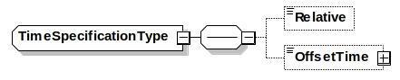

##### Relative

*IndicatorType*

If TRUE then the date/time is relative time, if FALSE then the date/time is absolute time. 

##### OffsetTime

*DateTimeType*

If the time is relative, then the offset defines the absolute time that may be added to the relative times to determine the absolute times.

#### UserAttribute

*UserAttributeType*

Defines user defined attributes and values for events. 

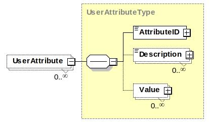
