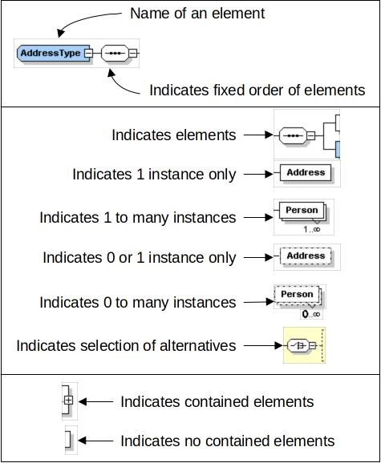
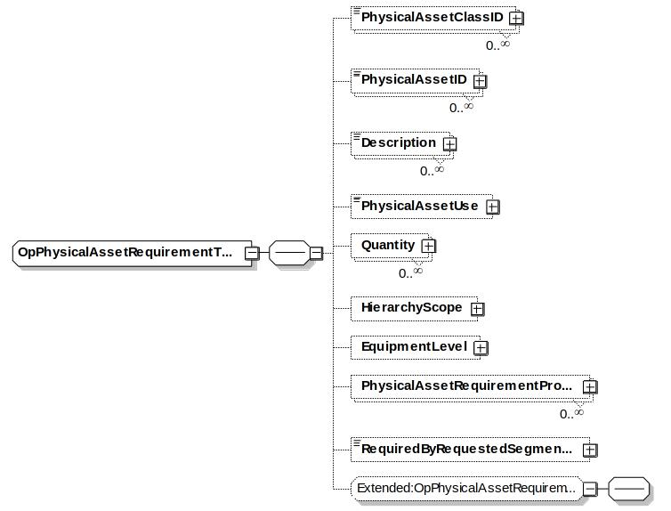

# B2MML - Common Types

The Business To Manufacturing Markup Language (B2MML) is used courtesy of MESA International.

## Diagram Convention

The schema diagrams using the following convention to illustrate the structure of the schema elements, the type of the elements and attributes, and the rules for optional elements and repetition. 



## Schema Scope

This document defines the information that is used in common by B2MML personnel, equipment, materials, maintenance, capabilities, product definition, production schedule, and production performance schemas.

This information is based on the data models and attributes defined in the ANSI/ISA 95 Enterprise/Control System Integration standard. Contact ISA (The Instrumentation, System, and Automation Society) for copies of the standard. Additional information on the standard is available at www.isa.org. 

### Key Information Assumptions

The data represented in these schemas define information that is common across all of the schemas defined from the ANSI/ISA 95 standard.  

The common schema defines data types used in the other schemas.  

### Type Names

The XML schema uses a model that defines simple and complex data types for each element.  The data types all follow the convention of a suffix of “Type” added to the element name.

Schema definition:

````xsd
<xsd:element name = "SubmissionDate"  type = " SubmissionDateType"/>

<xsd:simpleType name=" SubmissionDateType">
       <xsd:restriction base="cc:DateTimeType">
       </xsd:restriction>
 </xsd:simpleType>
````

The method is the “Venetian Blind Model”, defined in the book Professional XML Schemas, 2001, published by WROX (ISBN 1-861005-47-4).  It makes all of the type names global and usable in user derived works, without a loss of context or additional information required to identify the element as of being of the same type as related B2MML elements.

### User Element Extensibility

In order to make the schemas more useful, selected elements include the ability for elements to be extended.  The extended elements are not defined in this standard and should not be considered understandable between applications without prior agreement. 
See [B2MML-Extensions](../B2MML-Extensions) for a complete explanation of user extensibility.

### Use of IDs in Schema Definitions

The use of IDs in the schema definition is based on the definition of IDs in the ANSI/ISA-95 Part 2 standard. Many elements in the exchanged information require unique IDs.  These IDs should be considered unique only within the scope of the exchanged information.  They may have not meaning beyond the scope of exchanged information.   

This will usually require translation of the element IDs from one system’s internal identification into a standard representation.   For example, a unit may be identified as resource “R100011” in the scheduling system and “East Side Reactor” in the manufacturing system. A unique identification set must be agreed to in order to exchange information.  Often the IDs may be the IDs of one or the other system in an exchange, assuming that the IDs are unique (within the scope of the exchanged information)

The element IDs are defined only to identify objects within related exchanged information sets. The element IDs are not intended to act as global object IDs or database index attributes.  

Generally elements that are elements of aggregations, and are not referenced elsewhere in the model, do not require unique IDs.

### Schema Includes and Imports

The following diagram illustrates the current MESA  schemas and the associated Include and Import structure.   

- The schemas with information common to all of the ISA 88 and ISA 95 schemas are shown in white.  
- The B2MML schemas representing the ISA 95 standard are shown in pink.  
- The BatchML schemas representing the ISA 88 Part 2 standard are shown in green.  These schemas use the B2MML common and core components schemas.
- The BatchML schemas representing the ISA 88 Part 3 General Recipe standard are shown in yellow. These schemas use the B2MML common and core component schemas. 
- The BatchML schemas representing the ISA 88 Part 4 Batch Production Record standard are shown in blue. These schemas include multiple other ISA 88 and ISA 95 schemas..


## UN/CEFACT Core Component Types

The base types for most elements are derived from core component types that are compatible with the UN/CEFACT core component types.  The UN/CEFACT core component types are a common set of types that define specific terms with semantic meaning (e.g. the meaning of a quantity, currency, amount, identifier,…).  The UN/CEFACT core components were defined in a Core Components Technical Specification (CCTS) developed by the ebXML project now organized by UN/CEFACT and ISO TC 154. 

**NOTE: The core components contain optional attributes that may be used to specify the context and source of the associated element value.  All attributes are optional in B2MML.**

The core components use several international standards for the representation of semantic and standardized information:

| Name                                  | Standard
|---------------------------------------|----------
| Country Code                          | ISO 3166.1
| Region Code                           | ISO 3166.2
| Language Code                         | ISO 639: 1988
| Currency Code                         | ISO 4217
| Date and Time Representation          | ISO 8601
| Unit Of Measure Code                  | UN/ECE Recommendation 20
| Unit of Transport or Packaging Code   | UN/ECE Recommendation 21

The core components are defined in the schema file: [B2MML-CoreComponents.xsd](../../../Schema/B2MML-CoreComponents.xsd)

### AmountType

*AmountType* is used to define a number of monetary units specified in a currency where the unit of currency is explicit or implied.  It is derived from a decimal. 

| Optional Attribute            | Base XML Type     | Description
|-------------------------------|-------------------|-------------
| **currencyID**                | normalizedString  | An identifier specifying the identification of a currency code.  Reference UN/ECE Rec 9, using 3-letter alphabetic codes, also available as ISO 4217. 
| ^^currencyCodeListVersionID** | normalizedString  | An identifier specifying the version of the currency code. The version of the UN/ECE Rec.9 code list. 

### BinaryObjectType

*BinaryObjectType* is used to define a data types representing graphics, pictures, sound, video, or other forms of data that can be represented as a finite length sequence of binary octets.  It is derived from *base64Binary*.


| Optional Attribute            | Base XML Type     | Description
|-------------------------------|-------------------|-------------
| **format**                    | string            | The format of the binary content.  No identifiers for standard formats are defined.
| **mimeCode**                  | normalizedString  | The mine type of the binary object. See IETF RFC 2045, 2046, and 2047.
| **encodingCode**              | normalizedString  | Specifies the decoding algorithm of the binary object. See IETF RFC 2045, 2046, and 2047.
| **characterSetCode**          | normalizedString  | The character set of the binary object if the mime type is text. See IETF RFC 2045, 2046, and 2047.
| **uri**                       | anyURI            | The Uniform Resource Identifier that identifies where the binary object is located. 
| **filename**                  | string            | The filename of the binary object. See IETF RFC 2045, 2046, and 2047.

### CodeType

CodeType is used to define a character string that is used to represent an entry from a fixed set of enumerations.   It is derived from the type *normalizedString*.  

All of the B2MML enumerations are derived from CodeType.  Also, B2MML elements that are not identifications of objects or other elements are derived from *CodeType*.

| Optional Attribute            | Base XML Type     | Description
|-------------------------------|-------------------|-------------
| **listID**          	        | normalizedString  | An Identifier specifying the identification of a code list that this is registered with at an agency.  For example: UN/EDIFACT data element 3055 code list
| **listAgencyID**              | normalizedString  | An Identifier specifying the agency that maintains one or more lists of codes. For example: UN/EDIFACT.
| **listAgencyName**            | string            | Text that contains the name of the agency that maintains the list of codes.
| **listName**                  | string            | Text that contains the name of a code list that this is registered with at an agency.  
| **listVersionID**             | normalizedString  | An Identifier specifying the version of the code list.
| **name**                      | string            | Text equivalent of the code content component.
| **languageID**                | language          | An Identifier specifying the language used in the code name.
| **listURI**                   | anyURI            | The Uniform Resource Identifier (URI) that identifies where the code list is located.
| **listSchemaURI**             | anyURI            | The Uniform Resource Identifier (URI) that identifies where the code list scheme is located.
 
### DateTimeType

*DateTimeType* is used to define a particular point in time together with the relevant supplementary information to identify the timezone information.  It is derived from the type *dateTime*.

In B2MML this is a specific instance on time using the ISO 8601 CE (Common Era) calendar extended format and abbreviated versions. For example:

yyyy-mm-ddThh:mm:ssZ for UTC as “2002-09-22T13:15:23Z”

| Optional Attribute            | Base XML Type     | Description
|-------------------------------|-------------------|-------------
| **format**                    | string            | Not needed in B2MML, but maintained for compatibility with OAGiS.  A string specifying the format of the date time content, however the format of the **format** attribute is not defined in UN/CEFACT specification.
 
### IdentifierType

*IdentifierType* is used to define a character string to identify and distinguish uniquely, one instance of an object in an identification scheme from all other objects in the same scheme.  It is derived from the type *normalizedString*.

All of the B2MML ID types are derived from *IdentifierType*.

| Optional Attribute            | Base XML Type     | Description
|-------------------------------|-------------------|-------------
| **schemaID**                  | normalizedString  | An Identifier specifying the identification of the identification schema. 
| **schemaName**                | string            | Text that contains the name of the identification scheme.
| **schemaAgencyID**            | normalizedString  | An Identifier specifying the identification of the agency that maintains the schema. 
| **schemaAgencyName**          | string            | Text containing the identification of the agency that maintains the schema.
| **schemaVersionID**           | normalizedString  | The version (as an Identifier) of the schema.
| **schemaDataURI**             | anyURI            | The Uniform Resource Identifier (URI) that identifies where schema data is located.
| **schemaURI**                 | anyURI            | The Uniform Resource Identifier (URI) that identifies where schema is located.
 
### IndicatorType

*IndicatorType* is used to define a list of two mutually exclusive Boolean values that express the only possible states of a property.  

Example:  “True” or “False”.   It is derived from the type *string*.

For B2MML purposes the defined values for indicator type is “True” and “False”. 

| Optional Attribute            | Base XML Type     | Description
|-------------------------------|-------------------|-------------
| **format**                    | string            | A string specifying whether the indicator is numeric, textual or binary; however the format of the format attribute is not defined in UN/CEFACT specification.

### MeasureType

*MeasureType* is used to define a numeric value determined by measuring an object along with the specified unit of measure.  It is derived form type *decimal*.

| Optional Attribute            | Base XML Type     | Description
|-------------------------------|-------------------|-------------
| **unitCode**                  | normalizedString  | The type of unit of measure.  See UN/ECE Rec 20. and X12 355.
| **unitCodeListVersionID**     | normalizedString  | The version of the unit of measure code list. 
 
### NameType

*NameType* is used to define the name of any element that requires a common name.  It is derived from the type *string*.

| Optional Attribute            | Base XML Type     | Description
|-------------------------------|-------------------|-------------
| **languageID**                | language          | An Identifier specifying the language used in the content component.
 
### NumericType

*NumericType* is used to define a numeric value determined by measuring an object along with the specified unit of measure.  It is derived from the type *decimal*. 

| Optional Attribute            | Base XML Type     | Description
|-------------------------------|-------------------|-------------
| **format**                    | string            | Specifies if the number is an integer, decimal, real number, or percentage.  No standard identifiers defined. 
 
### QuantityType

*QuantityType* is used to define a counted number of non-monetary units, possibly including fractions. It is derived from the type *decimal*.

| Optional Attribute            | Base XML Type     | Description
|-------------------------------|-------------------|-------------
| **unitCode**                  | normalizedString  | The unit of the quantity. May use UN/ECE Rec. 20.
| **unitCodeListIDOptional**    | Attribute         | Base XML Type
| **Description**               | normalizedString  | The identification of the code list for the quantity unit of measure.  
| **unitCodeListAgencyID**      | normalizedString  | The identification of the agency that maintains the quantity unit code list.
| **unitCodeListAgencyName**    | string            | The name of the agency that maintains the quantity unit code list.

## TextType

*TextType* is used to define a character string (i.e. a finite set of characters) generally in the form of words of a language.  It is derived from the type *string*. 

| Optional Attribute            | Base XML Type     | Description
|-------------------------------|-------------------|-------------
| **languageID**                | language          | An Identifier specifying the language used in the content component.
| **languageLocaleID**          | normalizedString  | An Identifier specifying the locale of the language
 
### String Type Usage

The support for UN/CEFACT core components and compatibility with OAGiS has required the use of three basic string types, each with separate purposes:

1. CodeType is required to be compatible with the core components 
2. xsd:normalizedString is required to be compatible with OAGiS transaction processing 
3. xsd:string is required to hold special characters (tab, LF, CR)

#### CodeType 
    
- CodeType is used anyplace there is an enumeration.  
- This follows the UN/CEFACT standard, it provides attributes that can be used to identify who “owns” the enumeration.  
- This is derived from the xsd:normalizedString.  
- As of V0700 it is used in 43 places.

#### xsd:normalizedString

- xsd:normalizedString is a string in which line feeds, carriage returns, and tabs have been replaced by blanks.  There can be multiple blanks in the string. 
- This is used in B2MML for all of the attributes defined in the core component types.  This should not be changed because it would no longer match the recommended Core Component types.   
- This is also used in the transaction elements in order to match the definition in the OAGiS schemas.  If we change it, then we are no longer compatible with the OAGiS transaction model.   It would probably not be a problem to change this to xsd:string, BUT it could cause very difficult to find problems of compatibility (for example someone uses a tab instead of a space, or has a non-printing CR in a string that causes it not to match the expected string.) 
- As of V0700 it is used in 584 places. 

#### xsd:string
     
- xsd:string is a string which may contain line feeds, carriage returns, and tabs.  
- This is used in the core component types for names and format strings, where tabs, LF, CR may be significant.  The B2MML mapping matches the current definition of the Core Component types and should not be changed.
- This is used in the places where the tab, LF, CR characters may be significant. This includes tag delimiters, order delimiters delimited data, and all **OtherValue** attributes in enumerated lists.  These should not be changed, because the tabs, LF and CR characters are important.   The “otherValue” types could probably be changed to xsd:normalizedString without any major impact, because these are usually just vendor specific enumerations. 
- As of V0700 it is used in 47 places. 

## Element Definitions

cc: 	Indicates derived from the core component name space type
xsd: 	Indicates derived from an XML type. 

### ActualEndTimeType

cc: *DateTimeType*

A date/time defining an actual ending time of an element.
A specific instance on time using the ISO 8601 CE (Common Era) calendar extended format and abbreviated versions. For example:
yyyy-mm-ddThh:mm:ss for local time as “2002-09-22T09:15:23”.

### ActualFinishType

cc: *DateTimeType*

A date/time defining an actual time an element finished.
A specific instance on time using the ISO 8601 CE (Common Era) calendar extended format and abbreviated versions. For example:
yyyy-mm-ddThh:mm:ssZ for UTC as “2002-09-22T13:15:23Z”.

### ActualStartTimeType

cc: *DateTimeType*

A date/time defining an actual starting time of an element.
A specific instance on time using the ISO 8601 CE (Common Era) calendar extended format and abbreviated versions.

### AnyGenericDataType

xsd: *string*

A text string that can contain any value from any of the generic data types, but with optional attributes from all of the Core Component types to allow further information on how the value should be interpreted. 

### AssemblyRelationshipType

cc: *CodeType*

Identifies the type of a relationship between assemblies definition.

This may be either a standard type or an application specific extended type.

Standard enumerations are:

- Permanent - An assembly that is not intended to be split during an operations process.
- Transient - A temporary assembly using during operations, such as a pallet of different materials or a batch kit.
- “Other - the type is an application specific extension and the value is defined in the attribute **OtherValue**.

### AssemblyTypeType

cc: *CodeType*

Identifies the type of an assembly.

This may be either a standard type or an application specific extended type.

Standard enumerations are:

- Physical - The components of the assembly are physically connected or in the same area.
- Logical - The components of the assembly are not necessarily physically connected or in the same area.
- Other - the type is an application specific extension and the value is defined in the attribute **OtherValue**.

### BillOfMaterialIDType

cc: *IdentifierType*

A string containing an identification of a material in a bill of material.

### BillOfMaterialsIDType

cc: *IdentifierType*

A string containing an identification of a bill of materials.

### BillOfResourcesIDType

cc: *IdentifierType*

A string containing an identification of a bill of resources.

### CapabilityTypeType 

cc: *CodeType*

Identifies the type of a capability/capacity definition.

This may be either a standard type or an application specific extended type.

Standard enumerations are:

- Used - A portion of a capacity that was used.
- Unused - A portion of a capacity that was unused
- Total - The total capacity, either used and unused, or committed, available, an unattainable. 
- Committed - The portion of a capacity that is currently in use or is scheduled for use.
- Available - The portion of a capacity that is currently available for use.
- Unattainable - The portion of a capacity that is currently not available for use, for example due to scheduled maintenance, unscheduled maintenance, or the current product mix.
- Other - the type is an application specific extension and the value is defined in the attribute **OtherValue**.

### CauseType

cc: *CodeType*

A string containing the cause description of a maintenance response. There are no standard types defined. 

### CertificateOfAnalysisReferenceType 

cc: *IdentifierType*

A string containing a reference (or ID) of a certification of analysis.

### ConfidenceFactorType

cc: *IdentifierType*

A string an identification of confidence.

For example: “20%”, “High”, “None”.

### CorrectionType

cc: *CodeType*

A string containing the description of the correction of a maintenance element. There are no standard types defined.

### DataTypeType 

cc: *CodeType*

An identification of the type of a parameter.

These types are based on the W3C types defined in the XSD specification, with the addition of “Enumeration” for user defined enumerations, “SVG” for graphical representation, and “Other” for application specific extended types. 

This may be either a standard type or an application specific extended type.

Standard enumerations are in **Bold**, UN/FAC types are *italic*:

- *Amount*
- *BinaryObject*
- *Code*
- *DateTime*
- *Identifier*
- *Indicator*
- *Measure*
- *Numeric*
- *Quantity*
- *Text*
- **string**
- **byte**
- **unsignedByte**
- **binary**
- **integer**
- **positiveInteger**
- **negativeInteger**
- **nonNegativeInteger**
- **nonPositiveInteger**
- **int**
- **unsignedInt**
- **long**
- **unsignedLong**
- **short**
- **unsignedShort**
- **decimal**
- **float**
- **double**
- **boolean**
- **time**
- **timeInstant**
- **timePeriod**
- **duration**
- **date**
- **month**
- **year**
- **century**
- **recurringDay**
- **recurringDate**
- **recurringDuration**
- **Name**
- **QName**
- **NCName**
- **uriReference**
- **language**
- **ID**
- **IDREF**
- **IDREFS**
- **ENTITY**
- **ENTITIES**
- **NOTATION**
- **NMTOKEN**
- **NMTOKENS**
- **dateTime**
- **SVG**
- **Enumeration**
- **Other**

If “Other” then the type is an application specific extension and the value is defined in the attribute **OtherValue**.

If “Enumeration” then the name of the enumeration is defined in the attribute **EnumerationID**. 

### DependencyType

cc: *CodeType*

A string defining the type of a dependency of segments.  There are two segments defined, A and B, this defines the type of the execution or timing dependency between the segments.  

This may be either a standard type or an application specific extended type.

Standard enumerations are:

- NotFollow	- B can not follow A
- PossibleParallel	- B may run in parallel to A
- NotInParallel	- B may not run in parallel to A
- AtStart	- Start B at A start
- AfterStart	- Start B after A start
- AfterEnd	- Start B after A end
- NoLaterAfterStart	- Start B no later than T 
  (Timing Factor) after A start
- NoEarlierAfterStart  	- Start B no earlier than T 
  (Timing Factor) after A start
- NoLaterAfterEnd	- Start B no later than T 
  (Timing Factor) after A end
- NoEarlierAfterEnd  	- B no earlier than T 
  (Timing Factor) after A end
- Other - the type is an application specific extension and the value is defined in the attribute **OtherValue**.

### DescriptionType 

cc: *TextType*

A string containing a description of an element. 

### DurationType

xsd: *duration*

A duration datatype used to define the time duration (expected or actual) of a segment.
"duration" is defined as a duration of time, as specified in ISO 8601, Section 5.5.3.2.  Its lexical representation is the ISO 8601 extended format: "PnYnMnDTnHnMnS".  The "P" (period) is required; "n" represents a positive number, years is (Y), months is (M), days is (D), (T) is required if time is specified, hours is (H), minutes is (M), and seconds is (S).   An optional preceding minus sign ("-") is also allowed to indicate a negative duration; if the sign is omitted then a positive duration is assumed.
For example:

````xml
	<some_element duration="PT2H5M2.37S" /> 
````

is a 2 hour, 5 minute, and 2.37 second duration.

### EarliestStartTimeType

cc: *DateTimeType*

A date/time defining the earliest start date and time of a segment.

A specific instance on time using the ISO 8601 CE (Common Era) calendar extended format and abbreviated versions.  

### EndTimeType

cc: *DateTimeType*

A date/time defining an ending time of a capability, production performance, or other element.

A specific instance on time using the ISO 8601 CE (Common Era) calendar extended format and abbreviated versions.

### EquipmentAssetMappingType

*(Complex type)*

Defines an instance of a mapping of equipment to a physical asset.

Contains the following elements:

- *EquipmentID* - Identifies equipment
- *PhysicalAsset* - Identified a physical asset
- *StartTime* - Identifies the start time of the association
- *EndTime* - Identifies the end time of the association


### EquipmentCapabilityTestSpecificationIDType

cc: *IdentifierType*

A string containing an identification of a capability test specification.

### EquipmentClassIDType

cc: *IdentifierType*

A string containing an identification of a class of equipment.

### EquipmentElementLevelType

cc: *CodeType*

An identification of the level of an equipment element.  

This may be either a standard type (ANSI/ISA-95.03) or an application specific extended type.

Standard enumerations are: 

- Enterprise
- Site
- Area
- ProcessCell
- Unit
- ProductionUnit
- ProductionLine
- WorkCell
- StorageZone
- StorageUnit
- WorkCenter
- WorkUnit
- EquipmentModule
- ControlModule
- Other

If “Other” then the type is an application specific extension and the value is defined in the attribute **OtherValue**.

### EquipmentIDType

cc: *CodeType*

An identification of the use of equipment.  No standard enumerations are defined. 

### EquipmentUseType

cc:*CodeType*

An identification of the type of material use.  

There are no standard enumerations defined.

### ExpirationTimeType 

cc: *DateTimeType*

A date/time containing the expiration date/time of a test result.

A specific instance on time using the ISO 8601 CE (Common Era) calendar extended format and abbreviated versions.

### HierarchyScopeType

A complex type identifying associated elements of the equipment hierarchy model. 

HierarchyScopeType is recursive so that it can contain the definition of a complete path in the equipment hierarchy.  

For example, a top level could be the name of the enterprise, with EquipmentElementLevel of “Enterprise”, which contains the name of the site, with EquipmentElementLevel of “Site”, which contains an area name, with EquipmentElementLevel of “Area”.  

The scope must be agreed to by communicating components.  For example, there may be an agreement to only supply the “Area” name, because the site and enterprise are implicitly defined through the messaging system.


### JobOrderCommandType

cc: *CodeType*

Identifies a job order command.

This may be either a standard type or an application specific extended type.

Standard enumerations, taken from ANSI/ISA88.01-2010 are:

- Start - Indicates that the job order is to be started.
- Stop - Indicates that the job order is to be stopped in a normal manner.
- Hold - Indicates that the job order is to be held for an indeterminate time until restarted.
- Restart - Indicates that the job order is to be restarted after a hold.
- Abort - Indicates that the job order is to be stopped in an aborted state.
- Reset - Indicates that the job order is to be placed into the idle state.
- Pause - Indicates that the job order is to be paused for a short time until it is resumed.
- Resume - Indicates that the job order is to be resumed after a pause.
- Other - the type is an application specific extension and the value is defined in the attribute **OtherValue**.

NOTE: These definitions are from the ISA 88.01 ed2 standard.

### JobOrdeCommandRuleType

cc *TextType*

A string containing Instruction to Execution Management activities specifying conditions to execute the command.

### JobOrdeDispatchType

cc: *CodeType*

A string containing the status of the entry from the perspective of the dispatch activity.  This status is similar to what a planner would write on his whiteboard to track a job order.

There are no standard types defined. 

### LatestEndTimeType

cc: *DateTimeType*

A date/time containing the latest end time of an element.

A specific instance on time using the ISO 8601 CE (Common Era) calendar extended format and abbreviated versions.

### LocationType

A complex type identifying the associated elements of the equipment hierarchy model (This element is the same as HierarchyScopeType but is included for backward compatibility.  THIS ELEMENT IS DEPRECATED AND MAY BE REMOVED IN A FUTURE RELEASE.).  

LocationType is recursive so that it can contain the definition of a complete path in the equipment hierarchy.  
For example, a top level could be the name of the enterprise, with EquipmentElementLevel of “Enterprise”, which contains the name of the site, with EquipmentElementLevel of “Site”, which contains an area name, with EquipmentElementLevel of “Area”.  

The scope must be agreed to by communicating components.  For example, there may be an agreement to only supply the “Area” name, because the site and enterprise are implicitly defined through the messaging system. 


### ManufacturingBillIDType

cc: *IdentifierType*

A string containing an identification of a Manufacturing Bill

### MaterialActualIDType

cc: *IdentifierType*

A string containing an identification of a material actual

### MaterialCapabilityIDType

cc: *IdentifierType*

A string containing an identification of a material capability

### MaterialClassIDType

cc: *IdentifierType*

A string containing an identification of a material class

### MaterialDefinitionIDType

cc: *IdentifierType*

A string containing an identification of a material definition.

### MaterialLotIDType

cc: *IdentifierType*

A string containing an identification of a material lot.

### MaterialRequirementIDType

cc: *IdentifierType*

A string containing an identification of a material requirement

### MaterialSpecificationIDType

cc: *IdentifierType*

A string containing an identification of a material specification

### MaterialSubLotIDType

cc: *IdentifierType*

A string containing an identification of a material sublot

### MaterialTestSpecificationDType

cc: *IdentifierType*

A string containing an identification of a material test specification.

### MaterialUseType

cc: *CodeType*

An identification of the type of material use.  

This may be either a standard type (ANSI/ISA-95) or an application specific extended type. 

Defined values for production operations are:
- Consumed
- Produced
- Consumable
- Other

Defined values for maintenance operations are:

- Consumable
- Replaced Asset
- Replacement Asset
- Other

Defined values for quality operations are:

- Consumable
- Sample
- Returned Sample
- Other

Defined values for inventory operations are:

- Consumable
- Carrier
- Returned Carrier
- Other

If “Other” then the type is an application specific extension and the value is defined in the attribute **OtherValue**.

### OpEquipmentCapabilityPropertyType

Contains a definition of the quantity of an equipment property, including the value used to identify the class subset of the capability, and the quantity of the capability.


### OpEquipmentCapabilityType

Contains a definition of an equipment capability. Including the type of the capability, the hierarchy scope of the capability, the time duration of the capability, the quantity of the capability, and the properties that may be required to identify capabilities of subsets of the class.


### OpEquipmentRequirementPropertyType

Contains a definition of a subset of an equipment resource used in a requirement, including the value used to identify the subset and the quantity of the resource used.


### OpEquipmentRequirementType

Contains a definition of an equipment requirement for a requirement, including an identification of the quantity of the resource used, or a definition of required subsets identified by resource properties.


### OpEquipmentSpecificationPropertyType

Contains a definition of an equipment property required for the specification, including the quantity of the resource, and a value used to identify the subset of the class.


### OpEquipmentSpecificationType

Contains a definition of the equipment resources required for a specification.  Includes the identification of the class or instance of the resources, the quantity of the resource, and the property specification if required to identify the resource. 


### OperationsDefinitionIDType

cc: *IdentifierType*

A string containing the identification of an Operations Definition.

### OperationsRequestIDType

cc: *IdentifierType*

A string containing the identification of an Operations Request.

### OperationsScheduleIDType

cc: *IdentifierType*

A string containing the identification of an Operations Schedule.

### OperationsSegmentIDType

cc: *IdentifierType*

A string containing the identification of an Operations Segment.

### OperationsTypeType

cc: *CodeType*

An identification of the type of an operation.  

This may be either a standard type (ANSI/ISA-95) or an application specific extended type.

Standard enumerations are: 

- Production
- Maintenance
- Quality
- Inventory
- Mixed
- Other

If “Other” then the type is an application specific extension and the value is defined in the attribute **OtherValue**.

### OpMaterialCapabilityPropertyType

Contains a definition of the quantity of a material property for a capability, including the value used to identify the class subset of the capability, the use of the material in the capability, and the quantity of the capability.


### OpMaterialCapabilityType

Contains a definition of a material capability. Including the type of the capability, the hierarchy scope of the capability, the time duration of the capability, the quantity of the capability, the use of the material (consumed or produced), any contained material assembly capability definitions, and the properties that may be required to identify capabilities of subsets of the class.


### OpMaterialRequirementPropertyType

Contains a definition of a subset of a material used in a requirement, including the value used to identify the subset and the quantity of the material used.


### OpMaterialRequirementType

Contains a definition of a material in a requirement, including an identification of the use of the material, the quantity of the material or a definition of required subsets identified by resource properties. 

A MaterialRequirement element may have a set of contained AsemblyRequirement elements to support hierarchical manufacturing bills. 


### OpMaterialSpecificationPropertyType

Contains a definition of a material property required for a specification, including the quantity of the resource, and a value used to identify the subset of the class.


### OpMaterialSpecificationType

Contains a definition of the material resources required a specification.  Includes the identification of the class or instance of the resources, the quantity of the resource, the use (consumed, produced), any specification assemblies, and the property specification if required to identify the resource. 

A ManufacturingSpecification element may have a set of contained AssemblySpecification elements to support hierarchical manufacturing bills. 


### OpPersonnelCapabilityPropertyType

Contains a definition of the quantity of a personnel property for a capabilitry, including the value used to identify the class subset of the capability, and the quantity of the capability.


### OpPersonnelCapabilityType

Contains a definition of a personnel capability. Including the type of the capability, the hierarchy scope of the capability, the time duration of the capability, the quantity of the capability, and the properties that may be required to identify capabilities of subsets of the class. 


### OpPersonnelRequirementPropertyType

Contains a definition of a subset of a personnel resource used in a requirement, including the value used to identify the subset and the quantity of the resource used.


### OpPersonnelRequirementType

Contains a definition of a personnel requirement for a requirement, including an identification of the quantity of the resource used, or a definition of required subsets identified by resource properties.


### OpPersonnelSpecificationPropertyType

Contains a definition of a personnel property required for a specification, including the quantity of the resource, and a value used to identify the subset of the class.


### OpPersonnelSpecificationType

Contains a definition of the personnel resources required for a specification.  Includes the identification of the class or instance of the resources, the quantity of the resource, and the property specification if required to identify the resource. 


### OpPhysicalAssetCapabilityPropertyType

Contains a definition of the quantity of a physical asset property for a capability, including the value used to identify the class subset of the capability, and the quantity of the capability.


### OpPhysicalAssetCapabilityType

Contains a definition of a physical asset capability. Including the type of the capability, the hierarchy scope of the capability, the time duration of the capability, the quantity of the capability, and the properties that may be required to identify capabilities of subsets of the class. 


### OpPhysicalAssetRequirementPropertyType

Contains a definition of a subset of a physical asset resource used in a requirement, including the value used to identify the subset and the quantity of the resource used.


### OpPhysicalAssetRequirementType

Contains a definition of a physical asset requirement for a requirement, including an identification of the quantity of the resource used, or a definition of required subsets identified by resource properties.



### OpPhysicalAssetSpecificationPropertyType

Contains a definition of a physical asset property required for a specification, including the quantity of the resource, and a value used to identify the subset of the class.


### OpPhysicalAssetSpecificationType

Contains a definition of the physical asset resources required for a specification.  Includes the identification of the class or instance of the resources, the quantity of the resource, and the property specification if required to identify the resource. 


### OtherDependencyType

cc: *CodeType*

A string containing the name of a non-standard dependency type.

### ParameterIDType

cc: *IdentifierType*

A string containing an identification of parameter.

### ParameterType

A complex type defining a parameter, with an ID and a value. Parameters may also be nested. 


### PersonIDType

cc: *IdentifierType*

A string containing the identification of a person.

### PersonNameType

cc: *IdentifierType*

A string containing the name of a person.

### PersonnelClassIDType

cc: *IdentifierType*

A string containing the identification of a personnel class.

### PersonnelUseType

cc: *CodeType*

An identification of the type of personnel use.  

There are no standard enumerations defined. 

### PhysicalAssetActualIDType

cc: *IdentifierType*

A string containing the identification of a physical asset ID.

### PhysicalAssetCapabilityTestSpecificationIDType

cc: *IdentifierType*

A string containing the identification of a physical asset capability test specification.

### PhysicalAssetClassIDType

cc: *IdentifierType*

An identification of the type of a physical asset class. 

### PhysicalAssetIDType

cc: *IdentifierType*

An identification of the type of a physical asset. 

### PhysicalAssetUseType

cc: *CodeType*

An identification of the type of physical asset use.  

There are no standard enumerations defined. 

### PlannedFinishType

cc: *DateTimeType*

A date/time containing a planned finishing time.

A specific instance on time using the ISO 8601 CE (Common Era) calendar extended format and abbreviated versions.

### PlannedStartType

cc: *DateTimeType*

A date/time containing a planned starting time.

A specific instance on time using the ISO 8601 CE (Common Era) calendar extended format and abbreviated versions.

### PriorityType

cc: *NumericType*

An integer that specifies a priority of a request. Lower numbers have higher priority (e.g., Priority 1 is more important than Priority 7).

### ProblemType

cc: *CodeType*

A string containing a description of a problem in a maintenance request.

### ProcessSegmentIDType

cc: *IdentifierType*

A string containing an identification of a process segment.

### ProductionRequestIDType	

cc: *IdentifierType*

A string containing an identification of a production request.

### ProductionScheduleIDType	

cc: *IdentifierType*

A string containing an identification of a production schedule.

### ProductProductionRuleIDGroup

A group definition that defines two elements used to identify a ProductProductionRule.


### ProductProductionRuleIDType

cc: *IdentifierType*

A string containing an identification of a product production rule.

### ProductProductionRuleType

cc: *IdentifierType*

A string containing a reference to an external product production rule (e.g. a recipe)

### ProductSegmentIDType

cc: *IdentifierType*

A string containing an identification of a product segment.

### PropertyIDType

cc: *IdentifierType*

A string containing the ID of a property.

### PublishedDateType

cc: *DateTimeType*

A date/time defining the published date/time of an element.

A specific instance on time using the ISO 8601 CE (Common Era) calendar extended format and abbreviated versions.

### QualificationTestSpecificationIDType

cc: *IdentifierType*

A string containing an identification of a qualification test specification.

### QuantityStringType 

xsd: *string*

A string containing the value of a quantity, encoded as a string type. 

### QuantityValueType

A complex type defining the quantity of a resource (e.g. 15 KG). It contains a value, a data type of the value and the unit of measure of the value. 

In some cases multiple quantities are allowed. This supports the concept of “catch weight” where there may be multiple measures of quantity, such as a count and a weight.  For example, a catch weight quantity for lobsters may include a count of the number of lobsters as one quantity and the total weight of lobsters as another quantity.  The “Key” element may be used to differentiate between the different quantity values.
QualityString, DataType, and UnitOfMeasure may be NULL (using ‘xsi:nil="true"’) in place of the element string


### ReasonType

cc: *CodeType*

A string containing the reason for a maintenance request.

### RelationshipFormType

cc: *CodeType*

A string used to indicate the form of a resource relationship.

The value must be one of the following standard enumerations: 

- Permanent - The resource relationship is permanent, with no expectation of change. 
- Transient - The resource relationship is temporary and may be changed. 
- Other - the type is an application specific extension and the value is defined in the attribute **OtherValue**.

### RelationshipType

cc: *CodeType*

A string used to indicate the type of a resource relationship. The value must be one of the following standard enumerations: 

- Logical - The relationship is logical and the resources may not be physically connected or in the same location. 
- Physical - The relationship is physical, with resources physically connected. 
- Other - the type is an application specific extension and the value is defined in the attribute **OtherValue**.

### RequestedCompletionDateType

cc:DateTimeType

A date/time containing the requested completion date of an element.

A specific instance on time using the ISO 8601 CE (Common Era) calendar extended format and abbreviated versions.

### RequestedPriorityType

cc: *NumericType*

An integer that specifies the requested priority of a request. Lower numbers have higher priority (e.g., Priority 1 is more important than Priority 7).

### RequestStateType

A string used by the ProductionSchedule, ProductionRequirement, and SegmentRequirement types to indicate the state of the requirement when the document was created. If not specified, then the value of “Released” is the default.

The value must be one of the following standard enumerations: 

- Forecast - The requirements have not been released for use. (For example, this may be a schedule which is an estimate of a future schedule to allow long-term planning by the receiver, with a later “Released” schedule when the schedule has been approved and released to production.) 
- Released - The requirements have been released for use. 
- Other - the type is an application specific extension and the value is defined in the attribute **OtherValue**.

### RequiredByRequestedSegmentResponseType

A string used by the production schedule, in a ProductionRequest/SegmentResponse to indicate if an element in a in the segment response should be returned in a ProductionResponse.   
The value must be one of the following standard enumerations: 

- Required - The SegmentResponse element is required to be returned in a ProductionResponse.
- Optional - The SegmentResponse element, with the associated ProductionSchedule/SegmentResponse structure may be returned in a ProductionResponse. 
- Other - the type is an application specific extension and the value is defined in the attribute **OtherValue**.

### ResourcesType

cc: *CodeType*

A description of the resources required for a maintenance element.

### ResponseStateType

A string used by the ProductionPerformance, ProductionResponse, SegmentResponse, and JobResponse types to indicate the state of the segment(s) when the document was created. If not specified, then the value of “Completed” is the default.

The value must be one of the following standard enumerations: 

    - Ready - The activities were ready to run, but is not yet running.
    - Running - The activities were running. 
    - Completed - The activities were completed.
    - Aborted - The activities were aborted.
    - Holding - The activities were holding.
    - Paused - The activities were paused.
    - Other - the type is an application specific extension and the value is defined in the attribute **OtherValue**.

### ResultType

A complex type containing the result of a test, including a data type, unit of measure and key. 
When multiple results are stored the “Key” element may be used to differentiate between the different result values. For example there may be multiple tests performed at different times and each result is recorded, the key value would contain the time in production (0:10.00, 0:20.00, 0:30.00).  
ValueString, DataType, and UnitOfMeasure may be NULL (using ‘xsi:nil="true"’) in place of the element string


### SegmentDependencyType

A complex type defining a dependency between segments.

NOTE: The SegmentID element can be used in place of the ProductSegmentID or the ProcessSegmentID. A segment dependency always appears in the context of a specific kind of segment so there is no need to indicate which sort of segment is concerned. Use of the SegmentID also allows for SegmentDependencyType in user  extensions.


### SegmentRequirementIDType

cc: *IdentifierType*

A string containing an identification of a segment requirement in an operations request. 

### StartTimeType

cc: *DateTimeType*

A date/time containing the start time for an element. 

A specific instance on time using the ISO 8601 CE (Common Era) calendar extended format and abbreviated versions.

### StatusTimeType

cc: *DateTimeType*

A date/time containing the time of a status for an element.

A specific instance on time using the ISO 8601 CE (Common Era) calendar extended format and abbreviated versions.

### StatusType

cc: *CodeType*

A string containing the status of an element.

### StorageHierarchyScopeType

cc: *IdentifierType*

A string containing an identification of a storage location.

### StorageLocationType

cc: *IdentifierType*

A string containing an identification of a storage location.

### TestDateTimeType 

cc: *DateTimeType*

A date/time type used in a test result.

A specific instance on time using the ISO 8601 CE (Common Era) calendar extended format and abbreviated versions.

### TestResultType

A complex type containing test results, including the list of results, expiration time of the test, the data and time of the test.


### UnitOfMeasureType

cc: *CodeType*

A string containing a unit of measure.

### ValueStringType- Work Master  The work definition is a work master, a template used for creation of work directives. 


xsd: *string*

The value for a value, encoded as a string. 

### ValueType

A complex type containing a value, the type of the data, the unit of measure of the value, and key.
When multiple values are stored the “Key” element may be used to differentiate between the different values. For example a value may be a series of numbers, such as a series of peak values from spectrometer.  ValueString, DataType, and UnitOfMeasure may be NULL (using ‘xsi:nil="true"’ in place of the element string).


 
### VersionType

cc: *IdentifierType*

A string containing an identification of a version.

### WorkRequestIDType

cc: *IdentifierType*

A string containing an ID of a work request. 
- Work Master  The work definition is a work master, a template used for creation of work directives. 

### WorkScheduleIDType

cc: *IdentifierType*

A string containing an ID of a work schedule. 

### WorkType

cc: *CodeType*

A string used to indicate the type of a work definition.

The value must be one of the following standard enumerations: 

- Work Master - The work definition is a work master, a template used for creation of work directives. 
- Work Directive - The work definition is a work directive, used to define the work for a specific job. 
- Other then the type is an application specific extension and the value is defined in the attribute **OtherValue**.

## Transaction Definitions

The [B2MML-Common.xsd](../../../Schema/B2MML-Common.xsd) schema contains a set of elements used to support the transactions as defined in the ISA 95 Part 5 Business-to-Manufacturing Transaction standard.   Transactions define sets of messages that are exchanged between applications according to a specific set of rules.  The transaction model follows the OAGiS 9.6 model for transaction messages using the OAGiS XML schema structure, but using data objects (nouns) that are B2MML elements (relating to the ISA 95 data objects).   

Transaction messages are based on the concept of VERBS and NOUNS.  Verbs define the action to be taken or the response to an action. Nouns define the data objects the actions are taken on.  The top level element of a XML document (the message) is named as the combination of the verb and the noun.  For example, a “Get” verb on **OperationsSchedule** nouns would have an element named **GetOperationsSchedule**.
  
Three different transaction models are defined:

1. A PULL model where a user of data requests the data from a provider using a GET verb, and where the provider of the data responds with a SHOW verb.
2. A PUSH model where a provider of data requests an action (processing, changing, or canceling) on the data by another user.
    a) A request to process the attached data is sent using the PROCESS verb and an optional response to the processing is returned using the ACKNOWLEDGE verb.   
*Note: The definition of word “process” as meaning “deal with” or “handle”.  A PROCESS verb is often the equivalent of a command to add the data, but usually the receiving entity performs further actions as a result of receiving the data.*
    b) A request to change information is sent using a CHANGE verb and an optional response to the change is returned using the RESPOND verb. 
    c) A request to cancel the attached data is sent using the CANCEL verb.  
*Note: The request to cancel indicates that the sender no longer needs the data.  Because the CANCEL is not sent by the owner of the data, the data are not necessarily deleted.*
3. A PUBLISH model where the publisher of data sends to users (subscribers) of the data.  
    a) A notification of new data is sent using a SYNC verb and the ADD option.  
    b) A notification of changed data is sent using a SYNC verb and the CHANGE option.
    c) A notification of deleted data is sent using a SYNC verb and the DELETE option. 

### Standard Transaction Element Structure

The standard structure used for all transaction elements is an element with the verb name prefixed to the element name.   For example, the element used to contain a **“Get”** message for a **“PersonnelInformation”** element would be **“GetPersonnelInformation”**.   Each transaction element contains two elements, an **ApplicationArea** and a **DataArea**, as shown in the figure and partial XML sample below.   


````xml
<GetPersonnelInformation … releaseID="B2MML-V04RC01">
	<ApplicationArea>
		…
	</ApplicationArea>
	<DataArea>
		<Get>
			…
		</Get>
		<PersonnelInformation>
			…
		</PersonnelInformation>
	<DataArea>
````

All transaction elements contain the same **ApplicationArea** element (see definition in Section 4.6).   Each **DataArea** is unique to the specific element type being exchanged. The **DataArea** contains two elements, an element that is specific to the verb (Get, Show, Process, Confirm, Acknowledge, …) and an element that defines the specific exchanged element (**PersonnelInformation**, **Equipment**, **MaterialLot**, **ProductionSchedule**, **ProcessSegment**, …).


All common transaction element types are prefixed with **“Trans”** and postfixed with **“Type”**.  For example the **ApplicationArea** is defined in the type **TransApplicationAreaType**, and the **Get** is defined in the type **TransGetType**.

### Message Confirmation

Any message may request confirmation of receipt of the message using a CONFIRM option that is defined in the message’s *ApplicationArea*.  The confirmation indicates successful processing of the message and returns error conditions if the initiating message could not be processed.  The CONFIRM option may specify the following options:

Option    | Option Description  
----------|---------------------
Never     | No confirmation requested.  (Note: Default value if option not defined.)
OnError   | Send back a confirmation only if an error has occurred.
Always    | Always send a confirmation regardless of the local processing.

All confirmations are returned in a single message (XML element) type of *ConfirmBOD*.  (Note: This follows the OAGiS definitions, where BOD is short for Business Object Document.) 

*NOTE: While any message may request confirmation (including a ConfirmBOD message), the recommended use is to only request confirmations for critical messages and only on CANCEL messages.  (Confirmation on SYNC messages may lead to a large number of messages that the publisher could take no effective action on, GET messages have SHOW responses, PROCESS messages have ACKNOWLEDGE responses, and CHANGE messages have RESPOND responses.)*

### PULL Transaction Model

The PULL transaction model is used when a user of data requests information from a provider of the data.  The request is defined in a message that contains a GET verb and an empty or partially defined element.

For example the following diagram indicates a GET/SHOW transaction.  


See the ISA 95 Enterprise-Control System Integration, Part 5, Business to Manufacturing Transaction standard for a complete specification of the empty and partially defined element rules on the GET.

For example, the **GetEquipmentClass** message would contain a partially defined **EquipmentClass** element, as shown in the following text from the ISA 95 Part 5 standard1. 

Value of Equipment Class ID | Value of Equipment Class Property ID  | Equipment Class Property Value  | Action on Object(s) Specified for the GET verb
----------------------------|---------------------------------------|---------------------------------|-----------------------------------------------
IDs specified               | not specified                         | not specified                   | Defines a request that the receiver is to return, in a SHOW message, all attributes about the specified Equipment Classes, all properties and their attributes, and the IDs of Equipment that are members of each Equipment Class.
IDs specified               | IDs specified                         | not specified                   | Defines a request that the receiver is to return, in a SHOW message, all attributes about the specified Equipment Classes, all of the specified Equipment Class Properties, and the IDs of Equipment that are members of each Equipment Class.
IDs specified               | IDs specified                         | Property Values Specified       | Defines a request that the receiver is to return, in a SHOW message, all attributes about the specified Equipment Classes where the Equipment Class Property value matches the specified property value, all of the specified Equipment Class Properties, and the IDs of Equipment that are members of each Equipment Class.
Wildcard specified          | not specified                         | not specified                   | Defines a request that the receiver is to return, in a SHOW message, all attributes and properties about the Equipment Classes that match the wildcard ID and the IDs of Equipment that are members of each Equipment Class. To return all Equipment Classes, specify a “&ast;” as the wildcard.
Wildcard specified          | Wildcard specified                    | not specified                   | Defines a request that the receiver is to return, in a SHOW message, all attributes of the Equipment Classes that match the wildcard IDs, and for each class return all Equipment Class Properties that match the property ID wildcards, and the IDs of Equipment that are members of each Equipment Class. <br/>To return a single property, specify the Equipment Class Property ID in the property ID wildcard. <br/>To return all Equipment Class Properties, specify a “&ast;” as the property ID wildcard. <br/>To return a single Equipment Class, specify the ID in the wildcard ID. <br/>To return all Equipment Classes, specify a “&ast;” as the ID wildcard. 

The SHOW message contains a required response status attribute of either Accepted or Rejected in the Show/ResponseCriteria/ResponseExpression element as shown in the figure below.  


### PUSH Transaction Model

The PUSH model uses PROCESS/ACKNOWLEDGE, CHANGE/RESPOND, and CANCEL messages for an application that is not the owner of data to request processing, changing, or canceling data to the data owner.

For example, the following diagram indicates a Process/Acknowledge transaction for a **ProductionSchedule** element.  The PROCESS message may contain a CONFIRM option and a ACKNOWLEDGE option, but normally only the ACKNOWLEDGE would be specified (not both). 
The PROCESS Acknowledgement option may specify the following options:

Option    | Option Description
----------|--------------------
Never     | No acknowledge requested.  (Note: Default value if option not defined.) 
Always    | Always send an acknowledge response.

See the ISA 95 Part 5 standard for a complete definition of the action to be performed as the result of receiving a PROCESS message for each object (element) type. 


The following diagram illustrates a CHANGE/RESPOND transaction for a **ProductDefinition** element.  The CHANGE message may contain a CONFIRM option and a RESPOND option, but normally only one or neither would be specified (not both). 

The CHANGE respond option may specify the following options:

Option    | Option Description
----------|-------------------
Never     | No response requested.  (Note: Default value if option not defined.) 
Always    | Always send a response.

See the ISA 95 Part 5 standard for a complete definition of the action to be performed as the result of receiving a CHANGE message for each object (element) type.


The following diagram illustrates a CANCEL transaction for a **MaterialLot** element.  The CANCEL message may contain a confirmation option. 
See the ISA 95 Part 5 standard for a complete definition of the action to be performed as the result of receiving a CANCEL message for each object (element) type.


#### Process Acknowledgment

The acknowledge option is defined using optional attributes in PROCESS messages.  The PROCESS verb contains an optional **acknowledgeCode** attribute, as shown below in the **Process** element.


For consistency with OAGiS verb definitions, the PROCESS verb also contains an **ActionCode** element with **ActionExpression** elements.  This element is not used in the B2MML transactions. 

The ACKNOWLEDGE message contains a required **status** attribute in the **Acknowledge/ResposeCriteria/ResponseExpression** element, as shown below. 


#### Change Response

The CHANGE verb contains an optional **responseCode** attribute, as shown below in the Change element. 


For consistency with OAGiS verb definitions, the CHANGE verb also contains an ActionCode element with ActionExpression elements.  This element is not used in the B2MML transactions. 

The RESPOND message contains a required **status** attribute in the **Respond/ResponseCriteria/ResponseExpression** element. 

### PUBLISH Transaction Model

The PUBLISH model uses SYNC messages with ADD, CHANGE, or DELETE options to indicate the action to be taken on the published data. 

The following diagram illustrates a SYNC ADD transaction for a **Person** element

The **SyncPerson** (Add) message may be sent to multiple information subscribers when a new Person object is defined, but only one is shown in the example.

The SYNC message may contain a confirmation option, but this is not normally used in PUBLISH transactions.

See the ISA 95 Part 5 standard for a complete definition of the action to be performed as the result of receiving a SYNC ADD message for each object (element) type. 


The following diagram illustrates a SYNC CHANGE transaction for a **ProcessSegment** element.

The **SyncPerson** (Change) message may be sent to multiple information subscribers when a **ProcessSegment** object is changed, but only one is shown in the example.

The SYNC message may contain a confirmation option, but this is not normally used in PUBLISH transactions.

See the ISA 95 Part 5 standard for a complete definition of the action to be performed as the result of receiving a SYNC CHANGE message for each object (element) type.


The following diagram illustrates a SYNC DELETE transaction for a **MaintenanceInformation** element.

The **SyncPerson** (Change) message may be sent to multiple information subscribers when **MaintenanceInformation** is deleted, but only one is shown in the example.

The SYNC message may contain a confirmation option, but this is not normally used in PUBLISH transactions.

See the ISA 95 Part 5 standard for a complete definition of the action to be performed as the result of receiving a SYNC DELETE message for each object (element) type.


The SYNC options are specified in the required attribute of the **Sync/ActionCriteria/ActionExpression** element.

There are multiple **ActionCriteria** elements allowed by the schema, but only one is used in the B2MML transactions. 


### Common Transaction Types and Elements

#### *TransAcknowledgeType*

- **Acknowledge**

Complex data type for an ACKNOWLEDGE verb in an Acknowledge&lt;Object&gt; message.

A complex type that contains two elements:

- **OriginalApplicationArea**: An optional copy of the **ApplicationArea** from the requesting Process message (see *TransApplicationAreaType*). This is included to assist in error handling by the requesting application. 
- **ResponseCriteria**: Zero or more elements (See *TransResponseCriteriaType*) that contain additional acknowledge information (including an action code.  
  - If no **ResponseCriteria** is present, then the action code of “Accepted” is the default. 
  - The first **ResponseCriteria** element defines the acknowledgement option.  The meanings of any additional **ResponseCriteria** are not defined in B2MML.


#### *TransactionCodeEnumerationType*

A string that contains an identification of the action to be performed as part of a verb.

The action codes are used for SYNC messages and as responses in CHANGE, CONFIRM, ACKNOWLEDGE and RESPOND messages.

The following enumerations are defined:

Enumeration   | Action Meaning
--------------|------------------
Add           | Used in a SYNC message to indicate a SYNC ADD action to be performed.
Change        | Used in a SYNC message to indicate a SYNC CHANGE action to be performed.
Delete        | Used in a SYNC message to indicate a SYNC DELETE action to be performed.
Replaced      | Used in a RESPOND message to indicate that the change was performed
Accepted      | Used in an ACKNOWLEDGE message to indicate that the PROCESS was performed <br/>Used in a CONFIRM message to indicate that the action was performed.<br/>Used in a SHOW message to indicate that the GET was performed and all data was returned.  <br/>This may include a SHOW message with no data elements, if the section criteria identified no data to be returned.
Modified      | Used in an ACKNOWLEDGE message to indicate that the PROCESS was performed but that the information was modified. <br/>Used in a RESPOND message to indicate that the CHANGE was performed but that the information was modified. <br/>Not used in a SHOW message.
Rejected      | Used in an ACKNOWLEDGE message to indicate that the PROCESS was rejected. <br/>Used in a RESPOND message to indicate that the CHANGE was rejected.<br/>Used in a CONFIRM message to indicate that the action was rejected.  <br/>Used in a SHOW message to indicate that the GET was not performed and that not data was returned. 

#### *TransactionCodeType*

A union type of an enumeration (see *TransActionCodeEnumerationType*) and a normalizedString.  This allows either a defined enumeration value (see above) or a user defined string.  The meanings of any user defined action code strings are not defined in B2MML. 

#### *TransActionCriteriaType*

- **ActionCriteria**

Data Type for a SYNC, PROCESS, CHANGE, and CANCEL message.

It contains one optional element **ActionExpression** (see *TransExpressionType*) that contains an action code for SYNC messages.

It also contains an optional **ChangeStatus** (see *TransChangeStatusType*) element for a definition of the change.  

If no **ActionExpression** is defined for a SYNC message, then the action code of “Add” is the default.


#### *TransApplicationAreaType*

- **ApplicationArea**
- **OriginalApplicationArea**

A complex type that contains:

- An optional identification of the sender of the message (see *TransSenderType*) 
- Zero or more optional identifications of the receiver of the message (see *TransReceiverType*)
- A required element with the creation date & time of the message.
- An optional electronic signature that can be used to sign the transaction message
- An optional ID (BODID) to be applied to exchanged data object.  This should be a GUID (Globally Unique Identifier) that uniquely identifies the data object. 
- An optional user area for user extended data.


#### *TransCancelType*

Data type for a CANCEL verb in a Cancel&lt;Object&gt; message. 

Contains an optional attribute **responseCode** of type *TransResponseCodeType*.

The **responseCode** specifies if a response is required.

The complex type also that contains an optional **ActionCriteria** (see *TransActionCriteriaType*) element for compatibility with OAGiS; however the **ActionCriteria** elements are not defined in a *TransCancelType* element in B2MML.  


#### *TransChangeStatusType*

- **ChangeStatus**

Defines the description for a response.

**Code** (*CodeType*): A user defined element for communication of all codes. No standard code types are defined. 

**Description** (*DescriptionType*): A text description of the overall reason for the response.  

**EffectiveDateTime** (*DateTimeType*): The effective date and time that response was generated, to allow backtracking of the reason for the response. 

**ReasonCode** (*CodeType*): Identifies the reason for the response activity. 

**Reason** (*TextType*): Text description of the reasons for the response.

**StateChange**: Information about any state changes associated with the response. 

**UserArea**: User defined ##any type. 


#### *TransChangeType*

Data type for a CHANGE verb in a Change&lt;Object&gt; message. 

Contains an optional attribute **responseCode** of type *TransResponseCodeType*.  The responseCode specifies if a response is required. 

The complex type also that contains an optional **ActionCriteria** (see *TransActionCriteriaType*) element for compatibility with OAGiS; however the **ActionCriteria** elements are not defined in a *TransChangeType* element in B2MML. 


#### *TransConfirmationCodeType*

A string used to indicate a confirmation, acknowledge, or respond code option in a message.

The value must be one of the following standard enumerations: 

- Always - Always return a confirm, acknowledge, or respond message. 
- Never - Never return a confirm, acknowledge, or respond message.
- OnError - Only return a confirm, acknowledge, or respond message if an error occurred during processing of the message’s action.

#### *TransConfirmType*

Data type for a CONFIRM verb in a ConfirmBOD message.  See the ConfirmBOD documentation for the full description of the confirm message.


#### *TransExpressionType*

- **ActionExpression**
- **ResponseExpression**

A complex type with:

- A simple type of “token”
- A required attribute of **actionCode** (see *TransActionCodeType*)
- An optional **expressionLanguage** attribute that specifies the language that may be used to interpret the tokens in the expression.  

The meaning of any text included in the token in a *TransExpressionType* is not defined in B2MML. 


#### *TransGetType*

Get

Data type for a GET verb in a Get&lt;Object&gt; message.  There are no attributes.  


#### *TransProcessType*

- **Process**

Data type for a PROCESS verb in a Process<Object> message. 

Contains an optional attribute **acknowledgeCode** of type *TransResponseCodeType*.  The **responseCode** specifies if a response is required. 


#### *TransReceiverType*

- **Receiver**

Contains information about the expected receiver of the message. 

This contains an optional **LogicalID** of the server and application for which the BOD is intended.

This contains an optional **ComponentID** of the server and application for which the BOD is intended.  It provides a finer level in addition to the **LogicalID**.

This contains zero or more optional IDs for the receiver of the message.  


#### *TransRespondType*

- **Respond**

Data type for a RESPOND verb in a Respond&lt;Object&gt; message. 


#### *TransResponseCodeType*

A string used to indicate if response is requested for the sent.

The value must be one of the following standard enumerations: 

- Always - Always return a response message. 
- Never - Never return a response message.

#### *TransResponseCriteriaType*

- **ResponseCriteria**

Data Type for an ACKNOWLEDGE, CONFIRM, SHOW, and RESPOND response.

It contains one optional element **ResponseExpression** (see *TransExpressionType*) that contains an action code. 

If no **ResponseExpression** is defined, then the action code of “Accepted” is the default. 

**ChangeStatus** is an optional element that contains the reason for the response.


#### *TransSenderType*

A complex type that identifies characteristics and control identifiers that relate to the application that created the transaction message.  The sender area can indicate the logical location of the application and/or database server, the application, and the task that was executing to create the data object.

- The format for the **LogicalID** is not defined in B2MML.  May contain a logical (not physical) identification of the sending task.
- The format for the **ComponentID** is not defined in B2MML. May contain additional detail for the **LogicalID**.
- The format for the **TaskID** is not defined in B2MML. It may describe the business event that initiated the need for the Business Object Document to be created.
- The format for the **ReferenceID** is not defined in B2MML. It may contain additional information that enables the sending application to indicate the instance identifier of the event or task that caused the data to be created. 
- The format for **ConfirmationCode** is defined in **TransConfirmationCodeType**. 
- The format for the **AuthorizationID** is not defined in B2MML. It may identify the authorization level of the user or application that is sending the data. This authorization level may indicate to the receiving system indicates what can be done on request.


#### *TransShowType*

Data type for a SHOW messages.


#### *TransSignatureType*

A ##any type that is used if the message is to be signed. It supports any digital signature that maybe used by an implementation. The optional **qualifyingAgencyID** attribute identifies the agency that provided the format for the signature.

In order to support digital signature specifications currently available or that will be developed in the future.  The **Signature** element is defined to have any content from any other namespace. The choice of which digital signature to use is left up to the specific implementation.


#### *TransStateChangeType*

- **StateChange**

Defines any state change associated with the response, such as a change from effective to obsolete.  

- **FromStateChange** (*CodeType*): Old state
- **ToStateChange** (*CodeType*): New state
- **ChangeDateTime** (*DateTimeType*): Date and time the change occurred.
- **Description** (*TextType*): Descriptions of the change.
- **Note** (*TextType*): Secondary notes associated with the change.
- **UserArea**: User ##any type


#### *TransSyncType*

Data type for SYNC messages. 


#### *TransUserAreaType*

- *UserArea*

A ##any type that is used to contain user data in the application area.  


### B2MML and OAGiS Differences

B2MML is designed to implement a subset of the OAGiS 9.6 message rules that are consistent with the ISA 95 Part 5 definitions.   Specifically the B2MML **ApplicationArea** and verb elements are subsets of the full OAGiS 9.6 specifications, with the differences listed in the following table. 

Element       | Differences
--------------|----------------
**Show**      | The OAGiS 9.6 ”Show” specification includes a set of optional attributes (**recordSetStartNumber**, **recordSetCount**, **recordSetTotal**, **recordSetCompleteIndicator**, and **recordSetReferenceId**) that are used by the responding task to indicate the status of the request and to define the scope of the information returned. These attributes are not defined for B2MML.  The Show message should return all elements of the Get request. 
**Get**       | The OAGiS “Get” specification includes a set of optional attributes (**uniqueIndicator**, **maxItems**, **recordSetSaveIndicator**, **recordSetStartNumber**, and **recordSetReferenceId**) that are used by the requesting application to control how many elements are returned. These attributes are not defined for B2MML.  The Show message should return all elements of the Get request. 
**ActionExpression** <br/>**ResponseExpression** | In B2MML this contains a required attribute that contains an actionCode. 
**ConfirmBOD**| B2MML contains only the Original Application Area, a free form text group, and user data.
OAGiS 9.6 also contains BOD Failure Message, BOD Success Message, and Partial BOD Failure Message areas.  
**DateTimeType**|B2MML has the *DateTimeType* derived from the *xsd:dateTime* type. OAGiS 9.6 has the *DateTimeType* derived from *xsd:string.*  B2MML is more restrictive than OAGiS, but OAGiS recommends the use of ISO 8601 CE format. 

